<div align="center">

# Design and Simulation of a 1:8 Analog Demultiplexer

### CMOS Transmission-Gate Architecture in Cadence Virtuoso

**Schematic-Level Analog IC Design • Functional Verification • Electrical Specification Validation**

<br>

<p>
  
  
  
  
  
</p>
<p>
  
  
  
  
</p>

<br>

<p>
  
  
  
  
  
</p>

</div>

---

## Overview

This project implements a **1:8 analog demultiplexer (DEMUX)** using a modular CMOS transmission-gate architecture in **Cadence Virtuoso**. The complete circuit is built as a **three-stage binary tree of seven 1:2 analog DEMUX cells**. Each 1:2 DEMUX contains **two CMOS transmission gates**, and each transmission gate contains one NMOS and one PMOS connected in parallel.

The design accepts:

- **Analog input:** $-3.5\text{ V}$ to $+3.5\text{ V}$
- **Supply rails:** $+4\text{ V}$ and $-4\text{ V}$
- **External select logic:** $0\text{ V}$ / $2\text{ V}$
- **Eight analog outputs:** $Y_0$ through $Y_7$

Separate simulations were used to verify **functional routing, ON resistance, input capacitance, turn-ON time, bandwidth, charge injection, analog signal range, and power dissipation**.

> [!NOTE]
> The 0/2 V select inputs are converted internally to complementary $\pm 4$ V control levels using ideal VCVS blocks. Therefore, the reported power is the simulated DEMUX/core rail power with ideal level conversion, not the power of a physical transistor-level level shifter.

---

## Table of Contents

- [Project Specifications](#project-specifications)
- [Theory of Operation](#theory-of-operation)
  - [What a 1:8 Analog DEMUX Does](#what-a-18-analog-demux-does)
  - [CMOS Transmission Gate](#cmos-transmission-gate)
  - [1:2 Analog DEMUX](#12-analog-demux)
  - [Why Seven 1:2 Cells Create a 1:8 DEMUX](#why-seven-12-cells-create-a-18-demux)
  - [Control-Level Conversion](#control-level-conversion)
- [Cadence Implementation](#cadence-implementation)
- [Functional Verification](#functional-verification)
- [Electrical Specification Verification](#electrical-specification-verification)
  - [ON Resistance and Analog Range](#1-on-resistance-and-analog-range)
  - [Input Capacitance](#2-input-capacitance)
  - [Turn-ON Time](#3-turn-on-time)
  - [-3 dB Bandwidth](#4--3-db-bandwidth)
  - [Charge Injection](#5-charge-injection)
  - [Power Dissipation](#6-power-dissipation)
    - [Op-Amp-Based Level Shifter](#op-amp-based-level-shifter)
    - [CMOS Level Shifter](#cmos-level-shifter)
- [Problems Encountered and Solutions](#problems-encountered-and-solutions)
- [Final Performance Summary](#final-performance-summary)
- [Limitations](#limitations)
- [Conclusion](#conclusion)

---

# Project Specifications

The required project specifications are shown below.

<p align="center">
  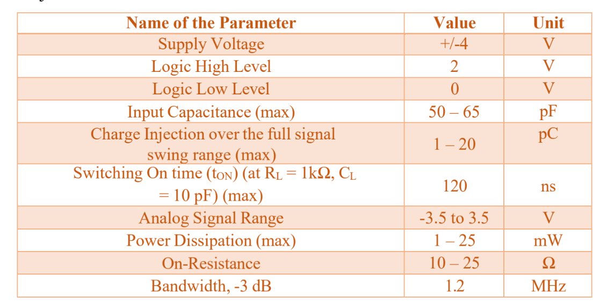
</p>

| Parameter | Required Value | Design / Verification Interpretation |
|---|---:|---|
| Supply voltage | $\pm 4\text{ V}$ | Fixed positive and negative rails |
| Logic HIGH | $2\text{ V}$ | External select input |
| Logic LOW | $0\text{ V}$ | External select input |
| Input capacitance | $50$–$65\text{ pF}$ | Final design tuned inside this band |
| Charge injection | $1$–$20\text{ pC}$ max | Worst case compared with $20\text{ pC}$ |
| Turn-ON time | $\le 120\text{ ns}$ | With $R_L=1\text{ k}\Omega$, $C_L=10\text{ pF}$ |
| Analog signal range | $-3.5$ to $+3.5\text{ V}$ | Full-swing signal transfer |
| Power dissipation | $1$–$25\text{ mW}$ max | Compared with $25\text{ mW}$ upper limit |
| ON resistance | $10$–$25\Omega$ | Complete selected three-stage path |
| Bandwidth, $-3$ dB | $1.2\text{ MHz}$ | Actual 1.2 MHz preferred; instructor allowed $f_{-3\text{dB}}>1.2\text{ MHz}$ if exact tuning is not achieved |

---

# Theory of Operation

## What a 1:8 Analog DEMUX Does

An **analog demultiplexer** routes one continuously varying analog input to exactly one of several outputs. Unlike a digital DEMUX, the selected path must reproduce analog voltage values across the allowed input range rather than only logic 0 and logic 1.

A 1:8 DEMUX requires three select bits because:

$$
2^3=8
$$

The select word $S_2S_1S_0$ determines the active output.

| $S_2S_1S_0$ | Selected Output |
|:---:|:---:|
| 000 | $Y_0$ |
| 001 | $Y_1$ |
| 010 | $Y_2$ |
| 011 | $Y_3$ |
| 100 | $Y_4$ |
| 101 | $Y_5$ |
| 110 | $Y_6$ |
| 111 | $Y_7$ |

---

## CMOS Transmission Gate

The basic analog switching element is a **CMOS transmission gate**. It uses an NMOS and a PMOS in parallel between the same two signal nodes.

<p align="center">
  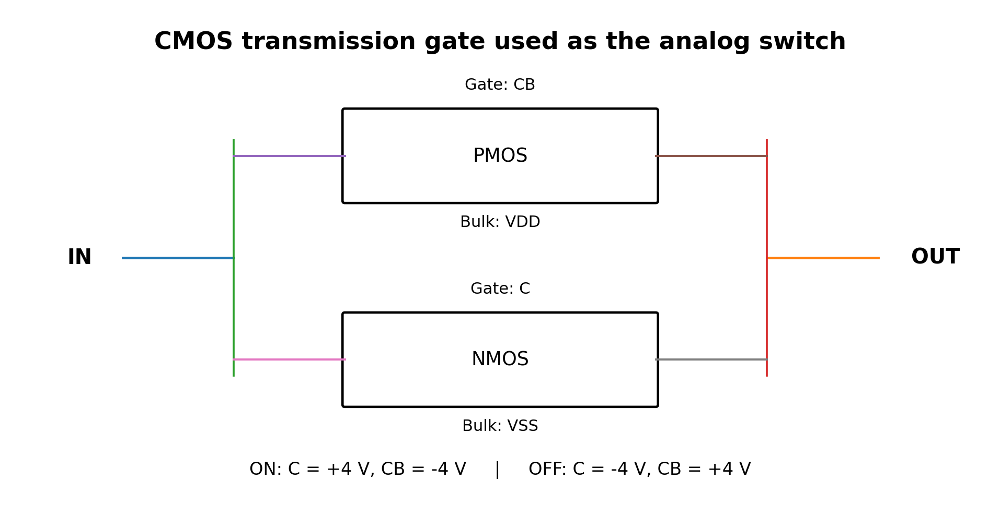
</p>

The NMOS is strong at passing lower voltages while the PMOS is strong at passing higher voltages. Using both in parallel improves signal transfer across the full analog range and makes the switch bidirectional.

For the implemented `tg_cell`:

- NMOS gate = `C`
- PMOS gate = `CB`
- NMOS bulk = `VSS`
- PMOS bulk = `VDD`

The control states are:

$$
\text{ON: } C=+4\text{ V},\qquad CB=-4\text{ V}
$$

$$
\text{OFF: } C=-4\text{ V},\qquad CB=+4\text{ V}
$$

<p align="center">
  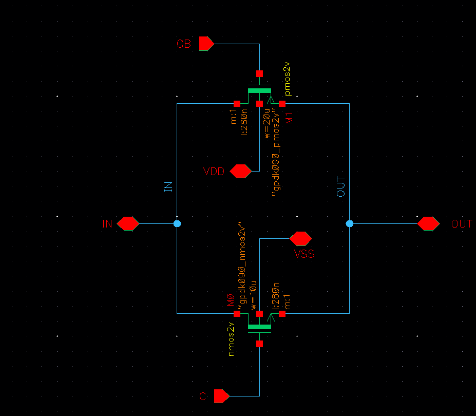
</p>

Final verified switch sizing:

- **NMOS total width:** approximately $100\,\mu\text{m}$ = $5\times20\,\mu\text{m}$
- **PMOS total width:** approximately $180\,\mu\text{m}$ = $6\times30\,\mu\text{m}$
- **Channel length:** $L=280\text{ nm}$

The PMOS is wider to compensate for its lower carrier mobility and to obtain sufficiently low total ON resistance.

---

## 1:2 Analog DEMUX

One 1:2 analog DEMUX is built using **two transmission gates sharing one input**.

- When `S = LOW`, the upper path is ON and the input is routed to `OUT0`.
- When `S = HIGH`, the lower path is ON and the input is routed to `OUT1`.

$$
S=0 \Rightarrow TG_0\text{ ON},\ TG_1\text{ OFF} \Rightarrow IN\rightarrow OUT_0
$$

$$
S=1 \Rightarrow TG_0\text{ OFF},\ TG_1\text{ ON} \Rightarrow IN\rightarrow OUT_1
$$

<p align="center">
  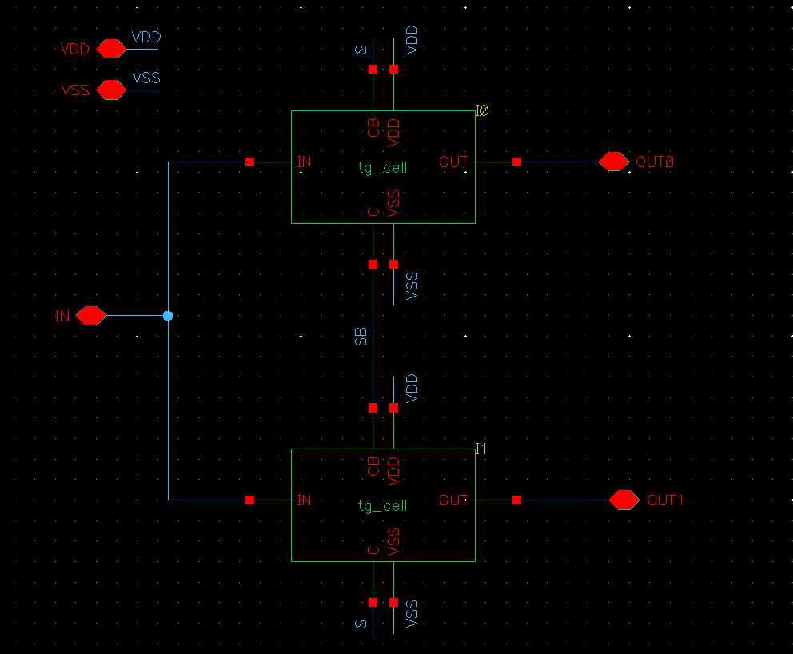
</p>

Because both transmission gates receive complementary control signals, only one output path is active for a given select state.

---

## Why Seven 1:2 Cells Create a 1:8 DEMUX

The complete circuit is a **three-stage binary tree**:

- **Stage 1:** 1 cell, controlled by $S_2$
- **Stage 2:** 2 cells, controlled by $S_1$
- **Stage 3:** 4 cells, controlled by $S_0$

Therefore:

$$
N_{1:2}=1+2+4=7
$$

Each 1:2 cell contains two transmission gates:

$$
N_{TG}=7\times2=14
$$

Each transmission gate contains two MOSFETs:

$$
N_{MOS}=14\times2=28
$$

<p align="center">
  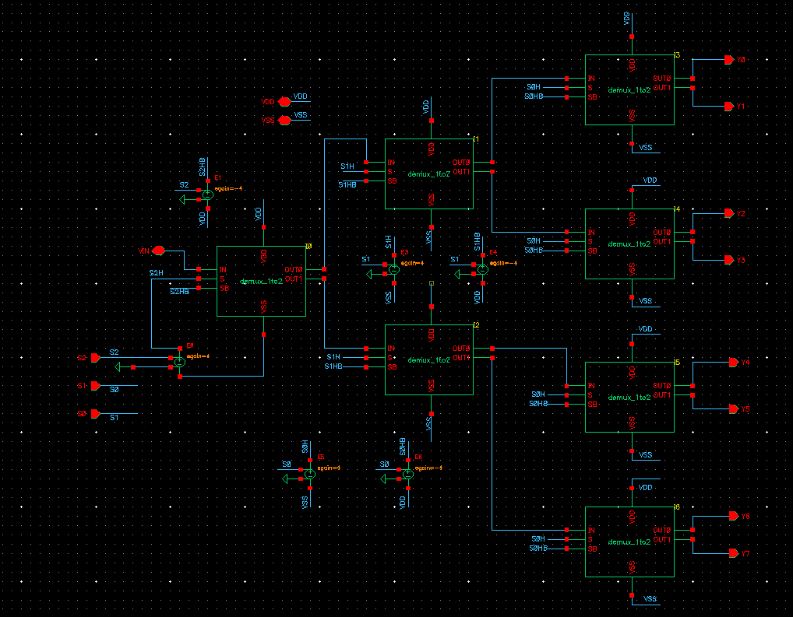
</p>

Every selected analog signal passes through exactly **three ON transmission gates in series**. This is why individual switch resistance must be kept low enough that the complete path still remains below the $25\Omega$ maximum.

---

## Control-Level Conversion

The external logic requirement is $0\text{ V}/2\text{ V}$, while the transmission gates are controlled using complementary $-4\text{ V}/+4\text{ V}$ signals.

Ideal VCVS blocks are used to generate:

$$
S_H=4S-4
$$

$$
S_{HB}=4-4S
$$

Therefore:

| External $S$ | $S_H$ | $S_{HB}$ |
|:---:|:---:|:---:|
| $0\text{ V}$ | $-4\text{ V}$ | $+4\text{ V}$ |
| $2\text{ V}$ | $+4\text{ V}$ | $-4\text{ V}$ |

<p align="center">
  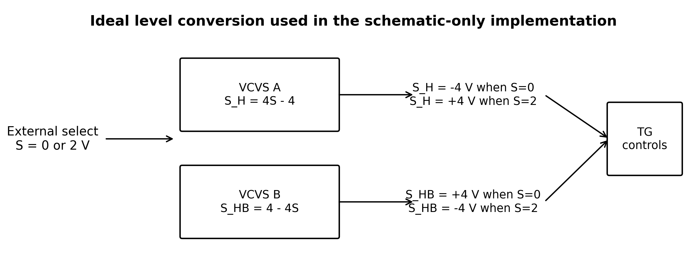
</p>

> [!IMPORTANT]
> This conversion is behavioral and ideal. It verifies control functionality but does not model the delay, power, area, or reliability of a physical high-voltage level shifter.

---

# Cadence Implementation

The design was divided into three hierarchical cells:

1. **`tg_cell`** — one NMOS and one PMOS in parallel.
2. **`demux_1to2`** — two `tg_cell` blocks sharing a common analog input.
3. **`demux_1to8`** — seven `demux_1to2` cells arranged as a 1-2-4 tree, with internal control-level conversion.

<p align="center">
  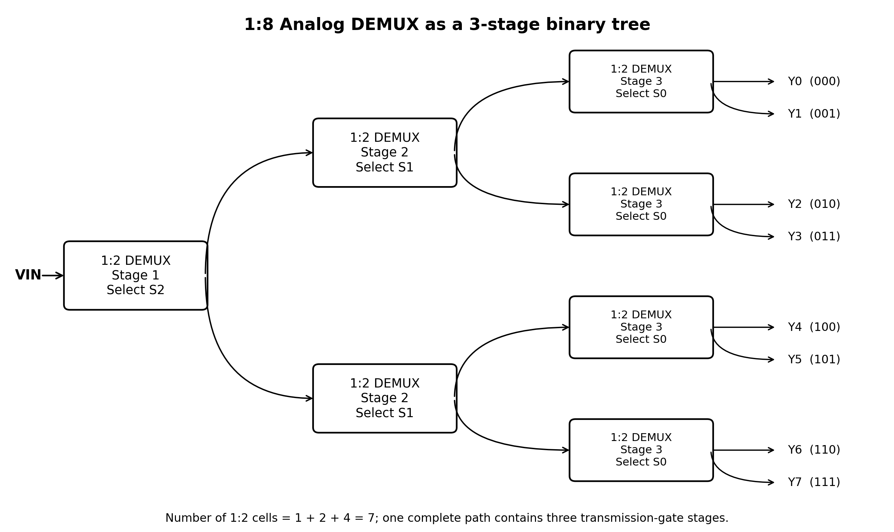
</p>

The analog path is connected as follows:

```text
VIN
 |
 I0  (S2)
 |-------------------|
I1 (S1)            I2 (S1)
|------|            |------|
I3    I4            I5    I6   (all controlled by S0)
| |    | |           | |    | |
Y0 Y1  Y2 Y3         Y4 Y5  Y6 Y7
```

### Final input-capacitance tuning

The original intrinsic input capacitance was approximately $2.05\text{ pF}$. To place the final design inside the project’s stated $50$–$65\text{ pF}$ band, approximately $53\text{ pF}$ was added internally from `VIN` to `VSS`.

$$
C_{IN,final}\approx C_{intrinsic}+C_{added}
$$

$$
C_{IN,final}\approx2.05\text{ pF}+53\text{ pF}\approx55\text{ pF}
$$

---

# Functional Verification

## Functional Testbench

A $100\text{ kHz}$ sine input with $3.5\text{ V}$ peak amplitude was used. The select inputs were driven by pulse sources with periods of $20\,\mu s$, $40\,\mu s$, and $80\,\mu s$ so that every select code occurs during one $80\,\mu s$ transient run.

<p align="center">
  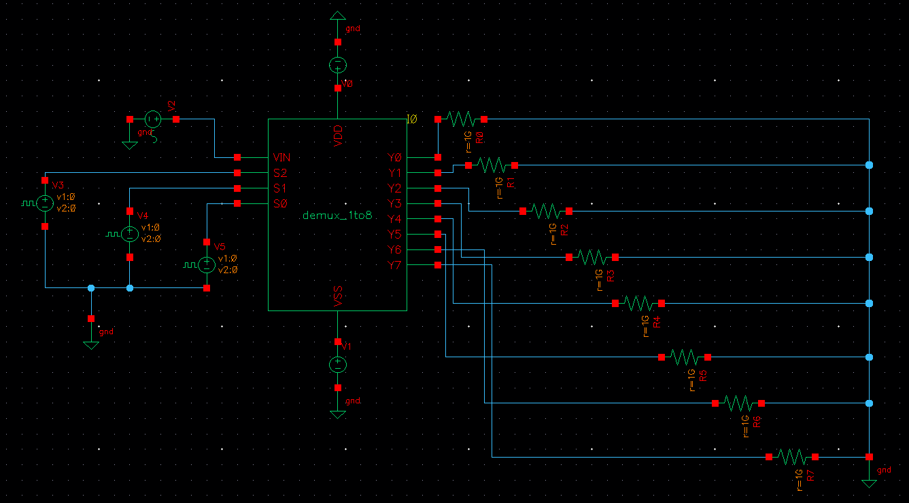
</p>

The expected sequence is:

| Time | Select | Active Output |
|---:|:---:|:---:|
| $0$–$10\,\mu s$ | 000 | $Y_0$ |
| $10$–$20\,\mu s$ | 001 | $Y_1$ |
| $20$–$30\,\mu s$ | 010 | $Y_2$ |
| $30$–$40\,\mu s$ | 011 | $Y_3$ |
| $40$–$50\,\mu s$ | 100 | $Y_4$ |
| $50$–$60\,\mu s$ | 101 | $Y_5$ |
| $60$–$70\,\mu s$ | 110 | $Y_6$ |
| $70$–$80\,\mu s$ | 111 | $Y_7$ |

## Eight-Output Routing Result

<p align="center">
  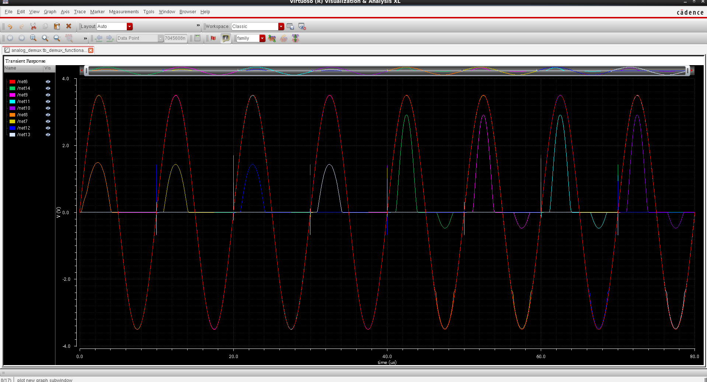
</p>

The waveform confirms that the input is routed to the correct output in every time slot. The selected output often lies directly on top of the red `VIN` waveform, which can make the selected colored trace difficult to distinguish.

### Fixed-code proof of selected-path gain

To confirm that the apparent amplitude differences in the eight-output plot were only OFF-state feedthrough, fixed-code tests were performed:

- `000` → $Y_0$ selected
- `100` → $Y_4$ selected

Both selected outputs overlap the input waveform.

<p align="center">
  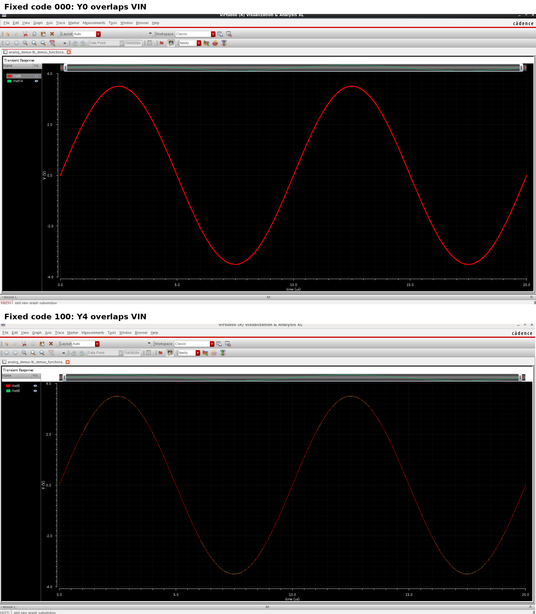
</p>

### OFF-state feedthrough

With extremely weak $1\text{ G}\Omega$ pull-downs, small parasitic waveforms appeared on unselected outputs. This is caused by capacitive feedthrough through MOS parasitic capacitances, not by incorrect routing. Using $10\text{ k}\Omega$ pull-downs for the functional demonstration brought the OFF outputs close to $0\text{ V}$ while causing negligible attenuation of the selected path.

---

# Electrical Specification Verification

Each electrical criterion was tested with a dedicated setup. This is more reliable than attempting to extract every parameter from one transient simulation.

---

## 1. ON Resistance and Analog Range

### Test condition

- Select code: `000` → $Y_0$
- $R_L=1\text{ k}\Omega$
- $V_{IN}=+3.5\text{ V}$ and $-3.5\text{ V}$

For a selected path modeled as $R_{ON}$ feeding $R_L$:

$$
R_{ON}=R_L\left(\frac{V_{IN}}{V_{OUT}}-1\right)
$$

### Positive endpoint

Measured:

$$
V_{IN}=3.5\text{ V},\qquad V_{OUT}\approx3.41627\text{ V}
$$

Therefore:

$$
R_{ON}=1000\left(\frac{3.5}{3.41627}-1\right)\approx24.51\Omega
$$

<p align="center">
  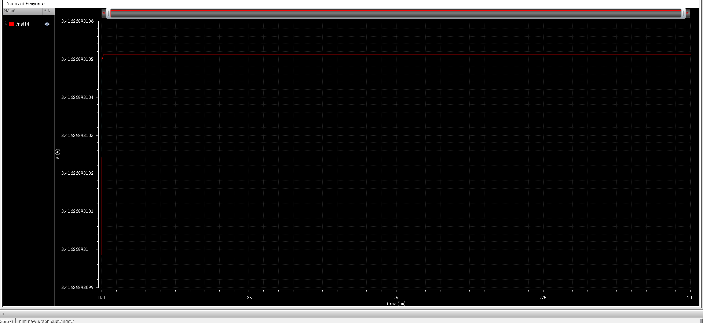
</p>

### Negative endpoint

Measured:

$$
V_{OUT}\approx-3.42517\text{ V}
$$

Using magnitudes:

$$
R_{ON}=1000\left(\frac{3.5}{3.42517}-1\right)\approx21.85\Omega
$$

Worst case:

$$
\boxed{R_{ON,max}\approx24.51\Omega}
$$

This remains below the $25\Omega$ maximum. The selected path also passed the required $-3.5\text{ V}$ to $+3.5\text{ V}$ analog range.

<p align="center">
  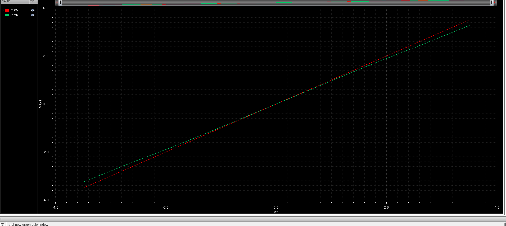
</p>

**Result:** ✅ **PASS** — worst-case full-path $R_{ON}\approx24.51\Omega$.

---

## 2. Input Capacitance

### Measurement method

- AC source magnitude: $1\text{ V}$
- Current probe in series with `VIN`
- Marker near $1\text{ MHz}$

For a capacitive input:

$$
C_{IN}=\frac{|I_{IN}|}{2\pi f|V_{AC}|}
$$

Final marker values:

$$
f=1.006643\text{ MHz}
$$

$$
|I_{IN}|=348.3155\,\mu\text{A}
$$

Thus:

$$
C_{IN}=\frac{348.3155\times10^{-6}}
{2\pi(1.006643\times10^6)(1)}
\approx55.07\text{ pF}
$$

<p align="center">
  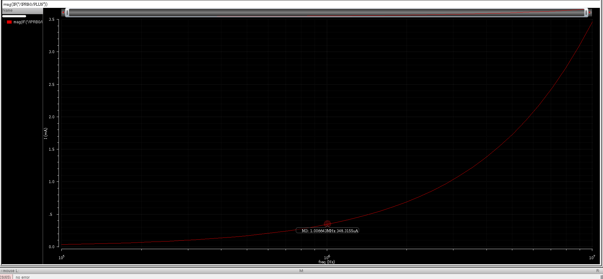
</p>

**Result:** ✅ **PASS** — $C_{IN}\approx55.07\text{ pF}$.

---

## 3. Turn-ON Time

### Test condition

- $V_{IN}=+3.5\text{ V}$ DC
- $S_2=S_1=0$
- $S_0:0\rightarrow2\text{ V}$ to select $Y_1$
- $R_L=1\text{ k}\Omega$
- $C_L=10\text{ pF}$

Turn-ON time was measured from the **50% point of the select transition** to the **90% point of the final output**:

$$
t_{ON}=t[V_{OUT}=0.9V_{final}]-t[S_0=1\text{ V}]
$$

Markers:

$$
t_1=100.50016\text{ ns}
$$

$$
t_2=101.09097\text{ ns}
$$

Therefore:

$$
\boxed{t_{ON}=101.09097-100.50016\approx0.59081\text{ ns}}
$$

<p align="center">
  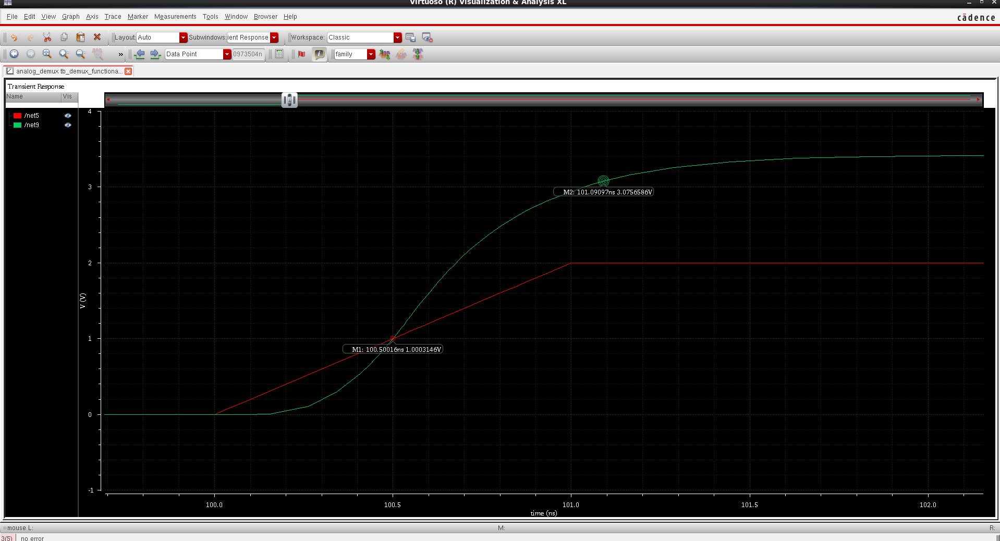
</p>

**Result:** ✅ **PASS** — $0.591\text{ ns}\ll120\text{ ns}$.

---

## 4. -3 dB Bandwidth

### Test condition

- Fixed code `000`
- AC input magnitude $=1\text{ V}$
- $Y_0$ load: $1\text{ k}\Omega\parallel10\text{ pF}$
- AC sweep extended to $1\text{ GHz}$

The plotted gain was:

$$
G_{dB}=20\log_{10}\left|\frac{V_{Y0}}{V_{IN}}\right|
$$

The low-frequency insertion loss was approximately:

$$
G_0\approx-0.123\text{ dB}
$$

Therefore the true 3 dB-down level is:

$$
G_{-3dB}\approx-0.123-3=-3.123\text{ dB}
$$

<p align="center">
  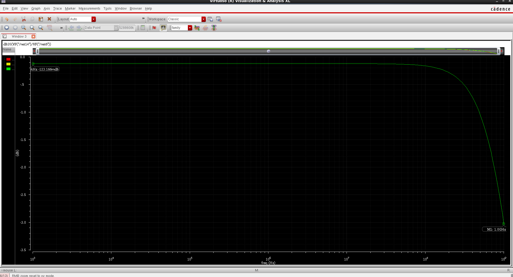
</p>

At $1\text{ GHz}$ the response was still only around $-3.0\text{ dB}$, so the exact $-3.123\text{ dB}$ crossing lies above $1\text{ GHz}$:

$$
\boxed{f_{-3dB}>1\text{ GHz}}
$$

The instructor clarified that an actual $1.2\text{ MHz}$ cutoff was preferred, but explicitly allowed a bandwidth greater than $1.2\text{ MHz}$ when exact tuning could not be achieved.

**Result:** ✅ **PASS under the instructor-approved fallback condition**.

---

## 5. Charge Injection

Charge injection was measured during an **ON-to-OFF** transition because the stored MOS channel charge is released when the transmission gate turns OFF.

### Test condition

- $Y_1$ initially selected
- $S_0:2\rightarrow0\text{ V}$
- $C_L=10\text{ pF}$
- $1\text{ G}\Omega$ weak DC path in parallel
- Tests at $V_{IN}=0\text{ V},+3.5\text{ V},-3.5\text{ V}$

The injected charge is:

$$
Q_{inj}=C_L|V_{after}-V_{before}|
$$

<p align="center">
  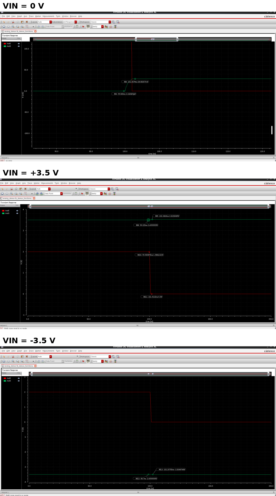
</p>

| $V_{IN}$ | $|\Delta V|$ | $Q_{inj}=10\text{ pF}\times|\Delta V|$ |
|---:|---:|---:|
| $0\text{ V}$ | $28.65\text{ mV}$ | $0.2865\text{ pC}$ |
| $+3.5\text{ V}$ | $23.507\text{ mV}$ | $0.2351\text{ pC}$ |
| $-3.5\text{ V}$ | $4.875\text{ mV}$ | $0.0487\text{ pC}$ |

Worst case:

$$
\boxed{Q_{inj,max}\approx0.287\text{ pC}}
$$

**Result:** ✅ **PASS** — far below the $20\text{ pC}$ maximum.

---

## 6. Power Dissipation

Power was measured during the complete $80\,\mu s$ functional switching sequence with:

- $100\text{ kHz}$ sine input
- $\pm3.5\text{ V}$ analog amplitude
- All select bits switching
- Maximum transient step $=0.5\text{ ns}$ to capture narrow switching-current spikes

Cadence returned:

$$
I_{VDD,avg}=+243.7\text{ nA}
$$

$$
I_{VSS,avg}=-205.2\text{ nA}
$$

Using the magnitude of each $4\text{ V}$ rail contribution:

$$
P_{total}\approx4(243.7\text{ nA})+4(205.2\text{ nA})
$$

$$
\boxed{P_{total}\approx1.7956\,\mu\text{W}\approx0.00180\text{ mW}}
$$

<p align="center">
  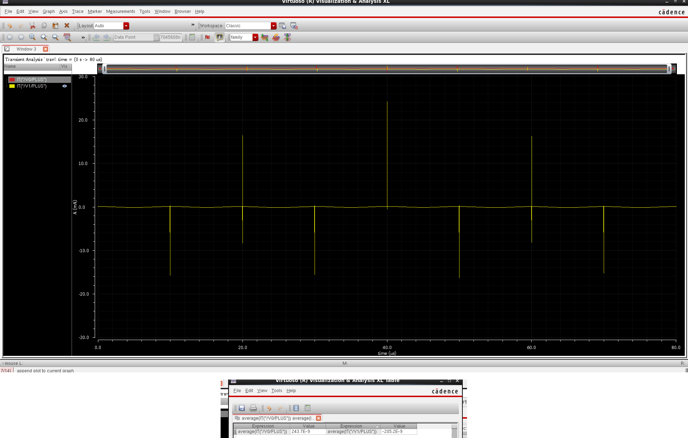
</p>

**Result:** ✅ **PASS** — much lower than the $25\text{ mW}$ maximum.

> [!WARNING]
> This is a **core/rail simulation estimate**. The internal level converters are ideal VCVSs, so a practical implementation would consume more power. Two realistic replacement options are summarized below.

### Op-Amp-Based Level Shifter

The ideal VCVS blocks could be replaced by op-amp-based level shifters that convert each 0–2 V select signal into approximately −4 V and +4 V control levels. Because both true and complementary control signals are required, a straightforward implementation would use about six op-amps for the three select bits.

With low-power op-amps drawing roughly 50–100 µA each, the control circuitry would consume about **2.4–4.8 mW**, which is comfortably below the **25 mW** limit. For faster switching, higher-slew-rate op-amps may be required. If each op-amp draws about 0.5 mA, six op-amps would consume approximately **24 mW**. This is still slightly below the limit, but it leaves very little power margin for the transmission-gate core and other switching losses. Op-amps drawing more than about 0.5 mA each could cause the complete implementation to exceed 25 mW.

Therefore, an op-amp solution is possible, but it is less power-efficient and provides less design margin.

### CMOS Level Shifter

A transistor-level CMOS level shifter is a more suitable practical replacement for the ideal VCVSs. It can convert each 0–2 V select input into the required ±4 V control levels while also generating the complementary signals needed by the transmission gates.

CMOS level shifters have very low static power and mainly consume energy while switching because of gate and internal capacitance charging. For this design, a realistic estimate for the **complete CMOS level-shifting circuitry plus the transmission-gate core** is approximately **0.1–1 mW**, with a representative value around **0.5 mW**. This is far below the **25 mW** specification and leaves a large safety margin.

Therefore, the CMOS level-shifter approach is the preferred practical implementation because it provides much lower power consumption and is better suited to fast digital control.

| Practical control implementation | Approximate power | Expected result vs. 25 mW limit |
|---|---:|:---:|
| Ideal VCVS simulation | 1.80 µW measured | PASS, but idealized |
| Low-power op-amp level shifting | 2.4–4.8 mW | PASS |
| High-speed op-amp level shifting | ~24 mW at 0.5 mA/op-amp | PASS, but very small margin |
| CMOS level shifting + TG core | ~0.1–1 mW | PASS with large margin |

---

# Problems Encountered and Solutions

| Problem / Observation | Resolution / Engineering Interpretation |
|---|---|
| Three cascaded switches made full-path resistance critical | Increased NMOS/PMOS widths using multiple fingers. The final complete path measured approximately $24.51\Omega$ worst case. |
| External 0/2 V logic could not directly generate strong complementary $\pm4$ V TG control | Used two ideal VCVS equations per select bit: $S_H=4S-4$ and $S_{HB}=4-4S$. |
| Cadence ground-net naming conflict | `analogLib/gnd` creates global `gnd!`. The competing local `ground` label was removed and `gnd!` was used consistently. |
| OFF outputs showed small sine-like waveforms | Identified as parasitic capacitive feedthrough with $1\text{ G}\Omega$ loads. Functional pull-downs were changed to $10\text{ k}\Omega$ to hold OFF outputs close to zero. |
| First DC ON-resistance attempt showed a ramp-like waveform | Replaced the input stimulus with a true `vdc` source and used a steady-state/DC measurement. |
| Intrinsic input capacitance was only about $2.05\text{ pF}$ | Added approximately $53\text{ pF}$ internally from `VIN` to `VSS`; final measured $C_{IN}\approx55.07\text{ pF}$. |
| Bandwidth graph appeared to show about $-123$ dB | The vertical unit was **mdB**, not dB. $-123\text{ mdB}=-0.123\text{ dB}$. The sweep was then extended to $1\text{ GHz}$. |
| The 1.2 MHz bandwidth requirement was ambiguous | Instructor clarified that an actual 1.2 MHz cutoff was preferred, but $f_{-3dB}>1.2\text{ MHz}$ was acceptable if exact tuning could not be achieved. |
| Charge injection could be confused with ordinary turn-ON behavior | Used an ON-to-OFF $2\rightarrow0\text{ V}$ transition with a $10\text{ pF}$ hold capacitor and measured the residual voltage step. |

---

# Final Performance Summary

| Criterion | Requirement | Achieved Value | Status |
|---|---:|---:|:---:|
| Supply voltage | $\pm4\text{ V}$ | $\pm4\text{ V}$ | ✅ PASS |
| Logic HIGH / LOW | $2\text{ V}/0\text{ V}$ | $2\text{ V}/0\text{ V}$ | ✅ PASS |
| Analog signal range | $-3.5$ to $+3.5\text{ V}$ | Verified across full range | ✅ PASS |
| ON resistance | $10$–$25\Omega$ | **$24.51\Omega$ worst case** | ✅ PASS |
| Input capacitance | $50$–$65\text{ pF}$ | **$55.07\text{ pF}$** | ✅ PASS |
| Turn-ON time | $\le120\text{ ns}$ @ $1\text{ k}\Omega\parallel10\text{ pF}$ | **$0.591\text{ ns}$** | ✅ PASS |
| Charge injection | $\le20\text{ pC}$ | **$0.287\text{ pC}$ worst case** | ✅ PASS |
| Power dissipation | $\le25\text{ mW}$ | **$\approx1.80\,\mu\text{W}$*** | ✅ PASS* |
| $-3$ dB bandwidth | Preferred $\approx1.2\text{ MHz}$; accepted fallback $>1.2\text{ MHz}$ | **$>1\text{ GHz}$** | ✅ PASS (fallback) |

\* Power is the simulated DEMUX/core rail power with ideal VCVS level conversion. A practical CMOS level-shifter implementation is estimated at approximately **0.1–1 mW total**, while an op-amp implementation could range from a few milliwatts to about **24 mW** depending on speed and quiescent current.

---

# Verification Test Matrix

| Test | Input | Control | Load | Analysis | Quantity Measured |
|---|---|---|---|---|---|
| Functional routing | $100\text{ kHz}$ sine, $3.5\text{ V}$ amplitude | $S_0/S_1/S_2$ cycle through 000–111 | $10\text{ k}\Omega$ on $Y_0$–$Y_7$ | 80 µs transient | Correct output sequence |
| ON resistance | $+3.5\text{ V}$ and $-3.5\text{ V}$ DC | 000 | $Y_0:1\text{ k}\Omega$ | DC / steady transient | $V_{OUT}$ and divider equation |
| Input capacitance | AC magnitude $=1\text{ V}$ | 000 | Weak output loads | AC, marker near 1 MHz | $|I_{IN}|\rightarrow C_{IN}$ |
| Turn-ON time | $+3.5\text{ V}$ DC | $S_0:0\rightarrow2\text{ V}$ | $Y_1:1\text{ k}\Omega\parallel10\text{ pF}$ | Transient, maxstep 0.5 ns | 50% select to 90% output |
| Bandwidth | AC magnitude $=1\text{ V}$ | 000 | $Y_0:1\text{ k}\Omega\parallel10\text{ pF}$ | AC 1 kHz to 1 GHz | $20\log_{10}|V_{Y0}/V_{IN}|$ |
| Charge injection | $0,+3.5,-3.5\text{ V}$ | $S_0:2\rightarrow0\text{ V}$ | $Y_1:10\text{ pF}\parallel1\text{ G}\Omega$ | Transient, maxstep 0.05 ns | $Q=C_L\Delta V$ |
| Power | $100\text{ kHz}$ sine, $\pm3.5\text{ V}$ | All select bits switching | Functional loads | 80 µs, maxstep 0.5 ns | Average VDD/VSS source currents |

---

# Key Equations

### Complete selected-path ON resistance

$$
R_{ON}=R_L\left(\frac{V_{IN}}{V_{OUT}}-1\right)
$$

### Input capacitance

$$
C_{IN}=\frac{|I_{IN}|}{2\pi f|V_{AC}|}
$$

### Turn-ON time

$$
t_{ON}=t(90\%\text{ output})-t(50\%\text{ select})
$$

### AC gain

$$
G_{dB}=20\log_{10}\left|\frac{V_{OUT}}{V_{IN}}\right|
$$

### Charge injection

$$
Q_{inj}=C_L|V_{after}-V_{before}|
$$

### Power

$$
P_{total}\approx|V_{DD}I_{DD,avg}|+|V_{SS}I_{SS,avg}|
$$

### Control-level conversion

$$
S_H=4S-4,\qquad S_{HB}=4-4S
$$

---

# Limitations

- The select-level conversion is **behavioral/ideal**. A practical implementation would require either a transistor-level CMOS level shifter or another physical driver. A CMOS solution is expected to remain well below 25 mW, while a high-speed op-amp implementation could approach the power limit.
- The `gpdk090/nmos2v` and `pmos2v` devices are low-voltage models; operation in the $\pm4$ V control environment is an **academic schematic-level assumption**, not a reliability-qualified implementation.
- No layout, DRC, LVS, or post-layout parasitic extraction was performed.
- Post-layout capacitance and resistance would change the simulated bandwidth, timing, and charge injection.
- The $10\text{ k}\Omega$ functional pull-downs are visualization loads. Each official parameter test used its required dedicated loading condition.
- The final $C_{IN}$ was deliberately tuned into the stated $50$–$65\text{ pF}$ band. If the wording is interpreted strictly as only a maximum limit, the original intrinsic capacitance was already below the limit.
- The design satisfies the instructor-approved **bandwidth > 1.2 MHz fallback**, but does not implement an actual 1.2 MHz cutoff.

---

# Conclusion

A complete **1:8 analog demultiplexer** was designed and simulated using a modular CMOS transmission-gate architecture. Seven 1:2 DEMUX cells form a three-stage binary tree controlled by $S_2$, $S_1$, and $S_0$. Each 1:2 cell uses two complementary CMOS transmission gates, producing a bidirectional selected path capable of transferring the required $\pm3.5\text{ V}$ analog signal.

The final simulations confirmed correct routing for all eight select codes. Dedicated verification setups demonstrated:

- Worst-case full-path ON resistance: **$24.51\Omega$**
- Input capacitance: **$55.07\text{ pF}$**
- Turn-ON time: **$0.591\text{ ns}$**
- Worst-case charge injection: **$0.287\text{ pC}$**
- Simulated DEMUX/core rail power: **$\approx1.80\,\mu\text{W}$**
- $-3$ dB bandwidth: **greater than $1\text{ GHz}$**, satisfying the instructor-approved fallback requirement

Within the schematic-and-simulation scope of the project, the design meets the accepted electrical requirements and demonstrates the complete operation of a CMOS transmission-gate based 1:8 analog DEMUX.

---

<div align="center">

### Built and verified in Cadence Virtuoso

**CMOS Transmission Gates • Hierarchical Analog Design • AC/DC/Transient Verification**

</div>
