# 6T SRAM Cell — Cadence Virtuoso

Schematic design, functional verification, custom layout, DRC closure, LVS, and RC parasitic extraction of a single-bit 6T SRAM cell.

**Results:** write/hold and read tests demonstrated; **DRC: no errors**; **LVS: schematic and layout match**; extracted view generated. **Post-layout simulation was not performed.**

## Tools and design

| Item | Configuration |
|---|---|
| Design environment | Cadence Virtuoso 6.1.5 / Layout XL |
| Simulation | ADE with Spectre; waveforms viewed in ViVA |
| Process | GPDK090; `pmos1v` and `nmos1v` |
| Devices | 2 pull-up PMOS, 2 pull-down NMOS, 2 access NMOS |
| Initial device sizing | All six: W = 120 nm, L = 100 nm, multiplier = 1 |
| Verification/extraction | Assura DRC, LVS, and parasitic extraction |
| External terminals | VDD, VSS, WL, BL, BLbar |

The recorded simulations use **VDD = 1.8 V**. This documents the experimental setup; the supported operating voltage of the installed device models was not independently established. Results are a functional demonstration, not PVT, reliability, or production qualification.

## 1. Schematic and initial DC test

Built two cross-coupled CMOS inverters, storing complementary values at **Q/Qb**, with access NMOS gates connected to WL. PMOS bodies connect to VDD; all NMOS bodies connect to ground/VSS, including the access devices whose signal terminals change voltage.

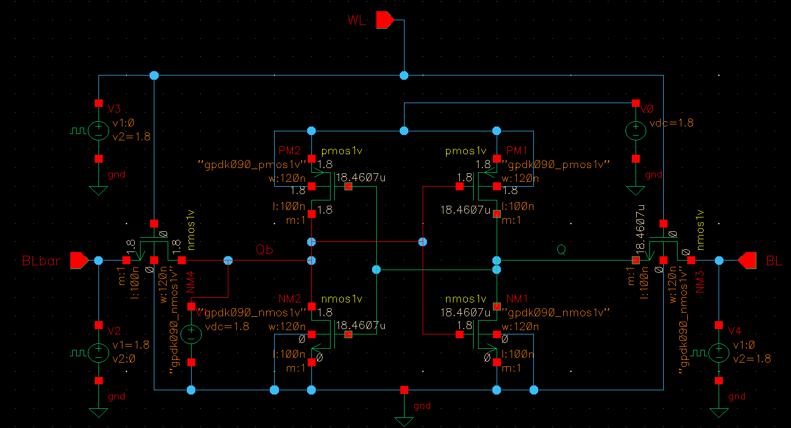

The initial tutorial test swept **V1 connected directly to Qb from 0 to 1.8 V**, producing a transfer curve and mirrored butterfly-style plot. This forced-node DC test did not demonstrate storage, and no numerical static noise margin was measured. V1 was removed for functional tests.

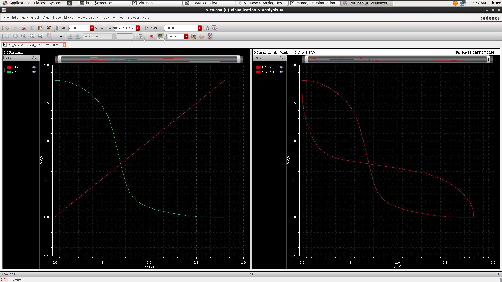

## 2. Write and hold verification

Applied complementary BL/BLbar pulses and enabled access with WL. Transient stop time: **85 ns**; rise/fall times: **100 ps**. WL delay/width/period: **10/20/40 ns**. Bit-line delay/width/period: **40/40/80 ns**, with BL initially HIGH and BLbar initially LOW.

| Approximate interval | Operation | Expected/observed stored state |
|---|---|---|
| 10–30 ns | Write 1, WL HIGH | Q = HIGH, Qb = LOW |
| 30–50 ns | Hold, WL LOW | State retained, including bit-line reversal at 40 ns |
| 50–70 ns | Write 0, WL HIGH | Q = LOW, Qb = HIGH |
| 70–85 ns | Hold, WL LOW | State retained, including bit-line reversal at 80 ns |

The intermediate voltage before the first write represents an uninitialized simulated state.

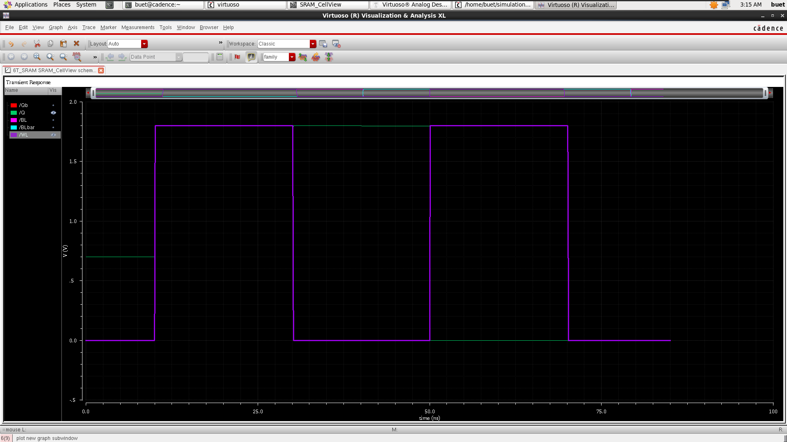

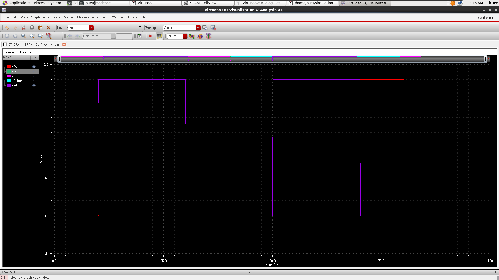

## 3. Read verification

Used a separate read testbench with **no bit-line voltage drivers**, a **10 fF capacitor on each bit line**, and initial conditions to represent stored data and precharged bit lines. This tests reading a preset state; it does not implement a physical precharge circuit or sense amplifier.

- Initially: BL = BLbar = VDD; Q/Qb initialized to 1/0 or 0/1.
- WL: LOW initially, HIGH at about **10 ns**, LOW again at about **20 ns**; stop time **25 ns**.
- ADE transient options: **ic = all**, **skipdc = no**.
- Read 1: BLbar discharged while BL stayed HIGH; Q recovered HIGH after a transient dip.
- Read 0: BL discharged; Q returned LOW after a transient rise.

The bit-line differential represents the read data. Slow pre-read bit-line droop is consistent with leakage from the floating precharged capacitors; its exact current paths were not measured.

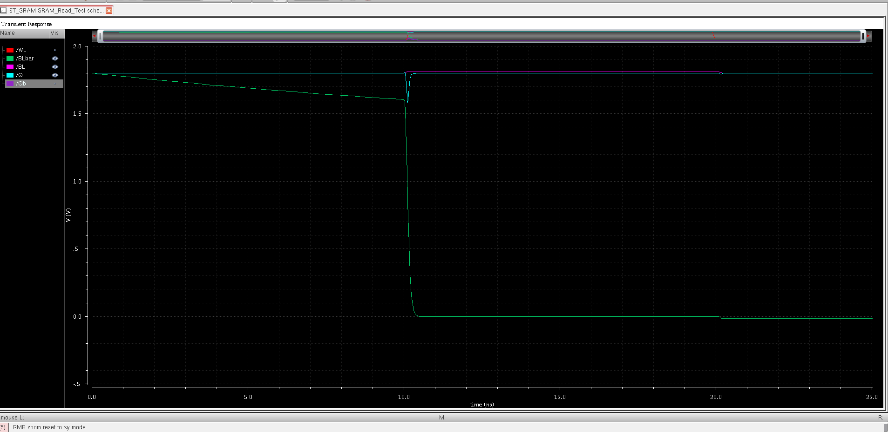

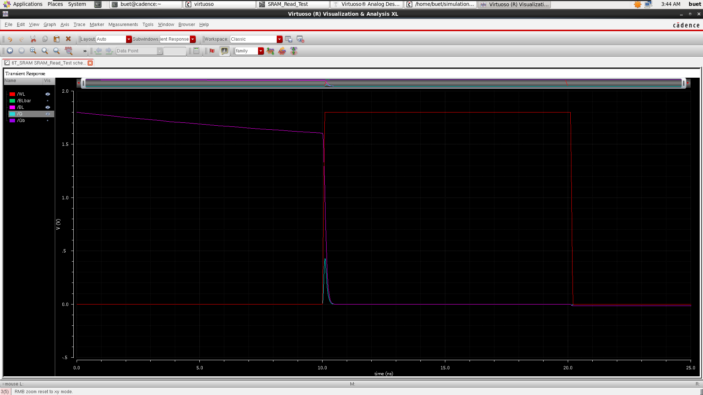

## 4. Core schematic and layout

Removed all test sources and capacitors from the layout-reference schematic. Added explicit **VDD/VSS** supply pins; Q/Qb remain internal nets.

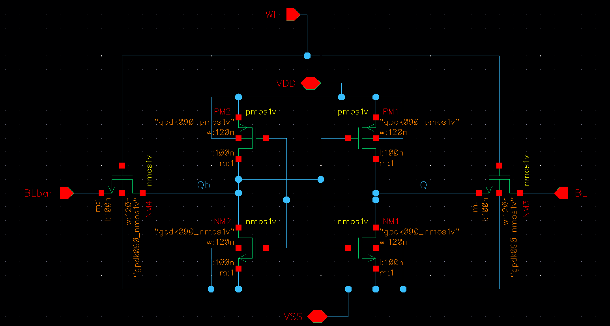

Generated devices and pins through **Layout XL → Generate All From Source**. Arranged the inverter pairs and access transistors, added gate contacts and detached body taps, then routed:

- **Metal1:** supply rails, body ties, and Q connections.
- **Metal2:** Qb routing and selected external extensions.
- **Metal3:** WL crossing the internal signal routes.
- **Via1:** Metal1–Metal2 transitions; **Via2:** Metal2–Metal3 transitions. No vias at crossings of unrelated nets.

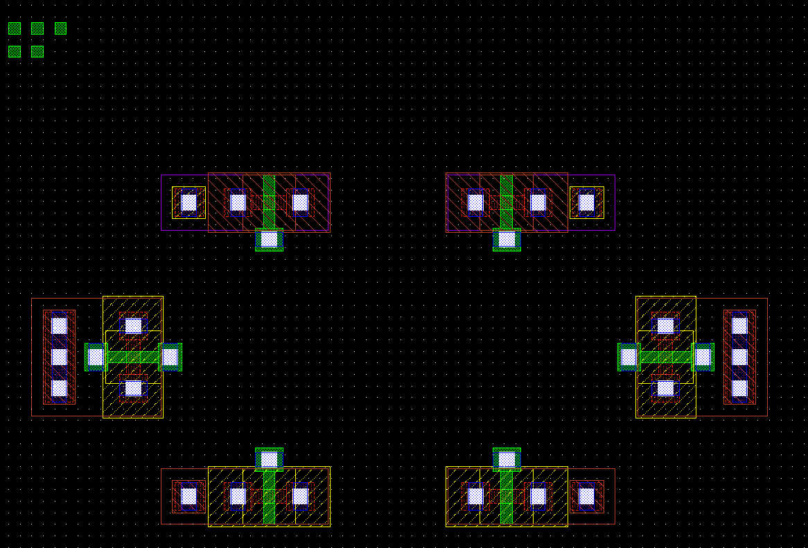

Used schematic-to-layout highlighting to identify terminals. Corrected accidental access-gate connections to VSS, completed body connections, and added missing vias. Placed external pins around the cell and changed their initial Poly shapes to match the underlying routing metal. These are cell terminals, not physical DIP/package leads.

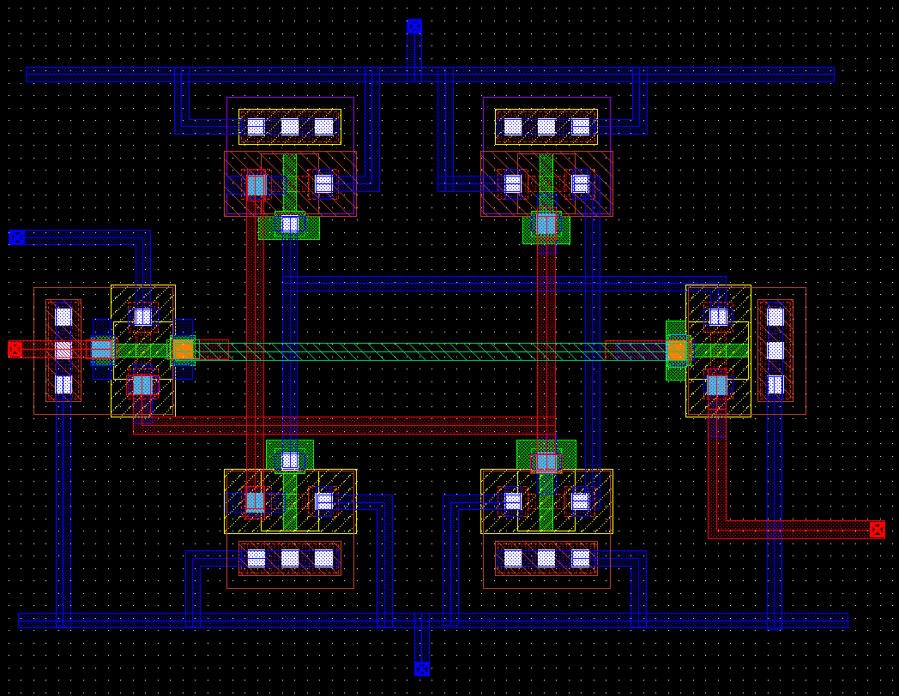

## 5. DRC errors and fixes

Ran Assura DRC, inspected individual markers, corrected geometry, saved, and reran. Results only update after a new run.

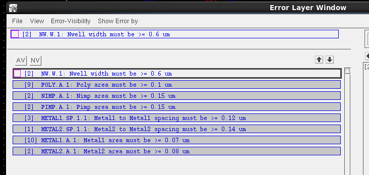

| Violation | Required minimum | Correction approach |
|---|---:|---|
| Nwell width | 0.6 µm | Enlarge well geometry without encroaching on NMOS regions |
| Nimp / Pimp area | 0.15 µm² | Adjust implant/tap geometry while preserving spacing and enclosure |
| Poly area | 0.1 µm² | Correct external pin layers; extend actual gate Poly into clear space outside active diffusion |
| Metal1 spacing | 0.12 µm | Reroute wires away from unrelated contact/landing pads |
| Metal2 spacing | 0.14 µm | Separate unrelated routes and via landing regions |
| Metal1 area | 0.07 µm² | Enlarge Metal1 landing areas using via enclosures |
| Metal2 area | 0.08 µm² | Enlarge intermediate Metal2 pads in via stacks |

Changing a gate's Poly over active diffusion would alter device dimensions, so gate-area extensions were kept outside the channel. Metal areas were checked separately: a long Metal2 route does not satisfy a small Metal1 pad's area requirement.

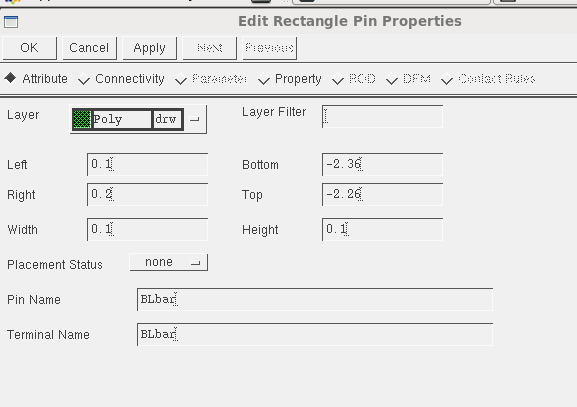

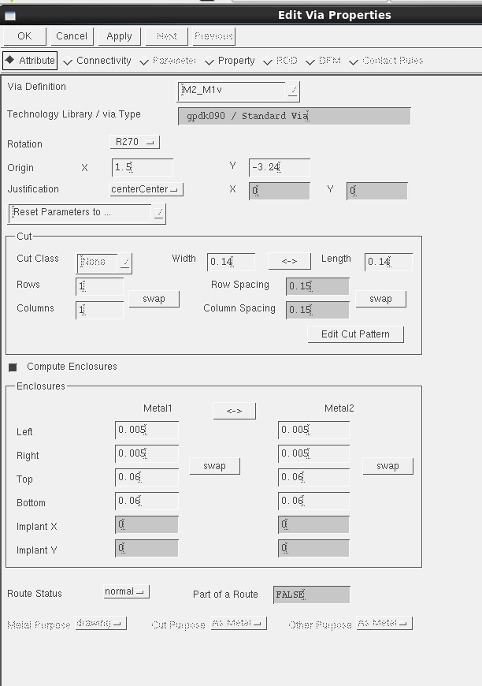

For a 0.14 × 0.14 µm via cut, the rectangular landing area is `(0.14 + left + right) × (0.14 + top + bottom)`. Example adjustments gave **0.072 µm² for Metal1** and **0.08 µm² for Metal2**. Enclosures were adjusted to available space and rechecked for spacing; these are geometry-specific examples, not universal via settings.

**Final result: No DRC errors found.**

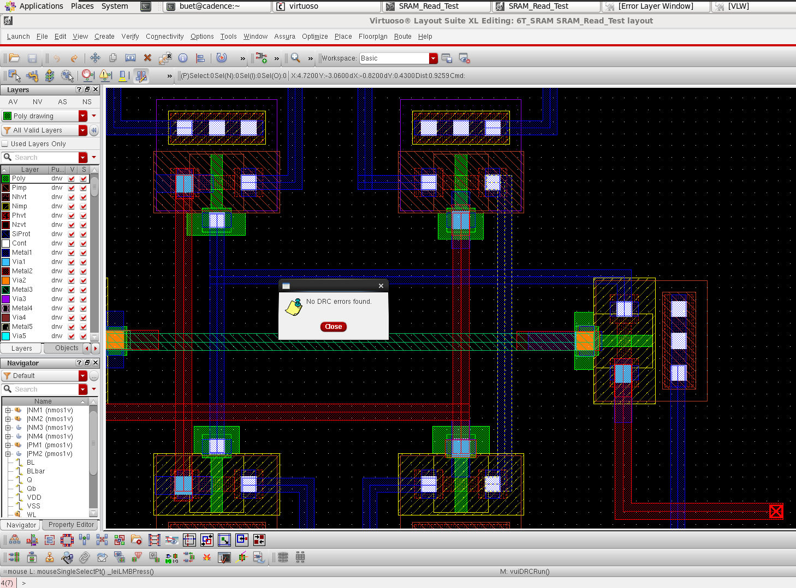

## 6. LVS verification

Compared the extracted layout connectivity against the six-transistor core schematic using Assura LVS.

**Result: Schematic and Layout Match**, with zero reported net, device, pin, and parameter mismatches; no reported malformed-device or label short/open problems.

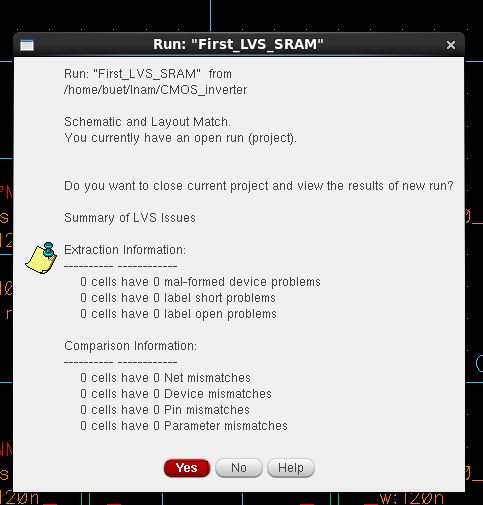

## 7. RC parasitic extraction

Opened the Assura Parasitic Extraction Run Form using **GPDK090 / default**, selected **RC**, **Full Chip All Nets**, and **Extracted View** output named **`av_extracted`**.

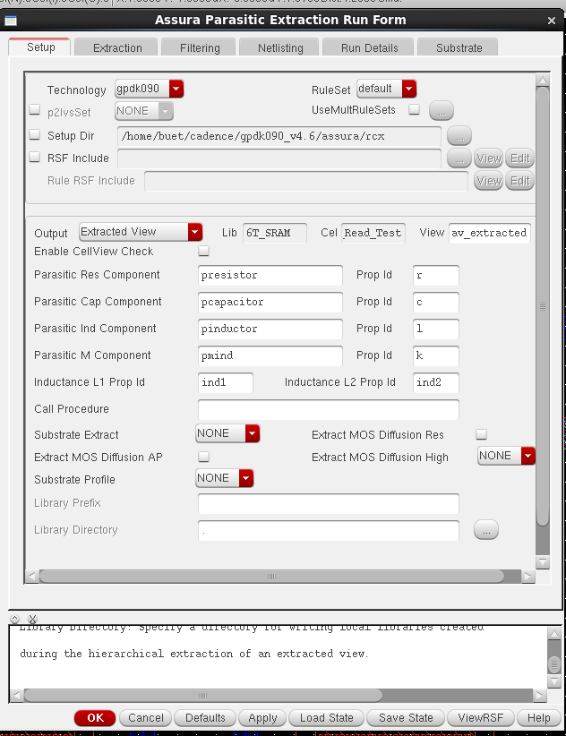

The captured options show **Decoupled**, **25°C**, and reference node **vss**. Matching the actual **VSS** terminal, using **27°C** for comparison with earlier runs, and preserving coupling were discussed afterward; the final settings/log were not captured, so those changes are not claimed here.

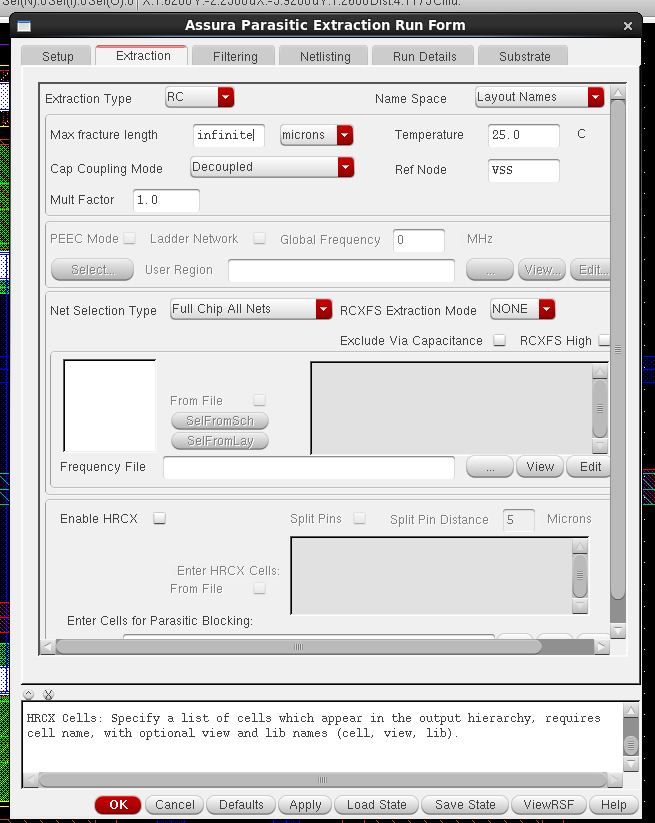

The resulting extracted-view screenshot shows device and parasitic-component representations over the layout.

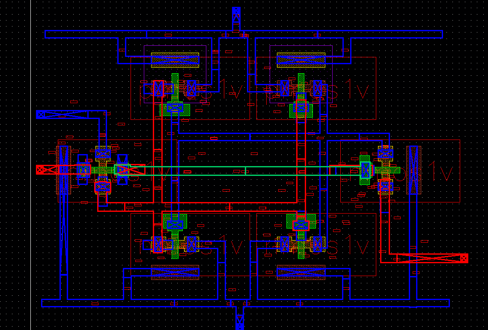

**Scope completed:** schematic → functional tests → layout → DRC clean → LVS match → extracted view. Post-layout simulation, numerical timing/power comparison, and PVT/Monte Carlo analysis remain outside this project record.

## Repository contents

`README.md` documents the workflow; `images/` contains the original screenshots used at each stage. Keep both together when uploading to GitHub. This documentation package does not include Cadence cellviews, the PDK, or rule decks.
