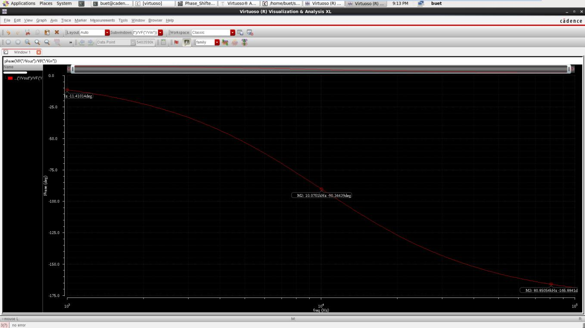
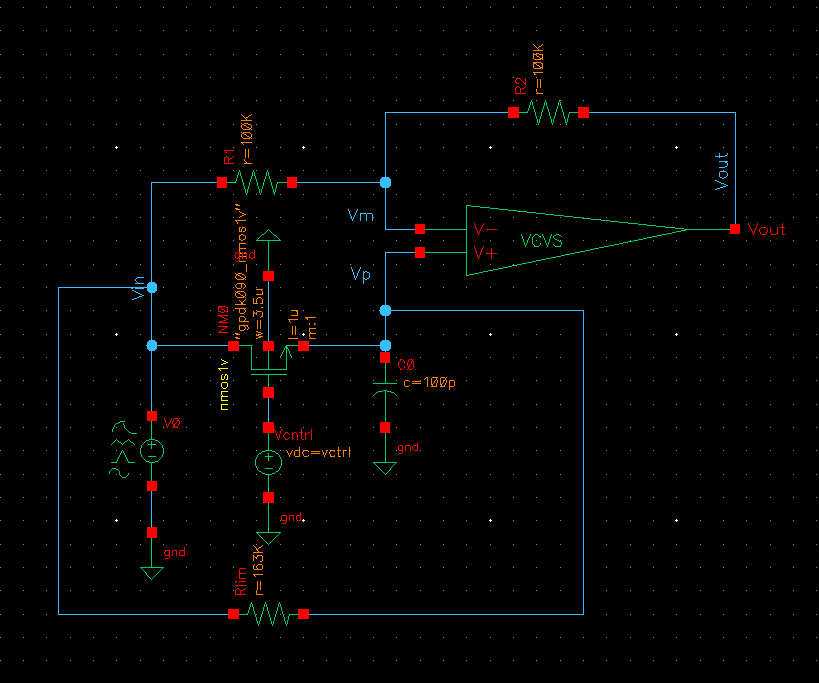
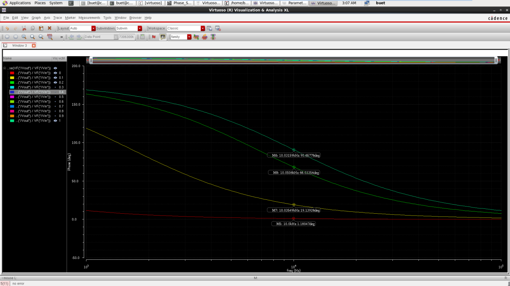
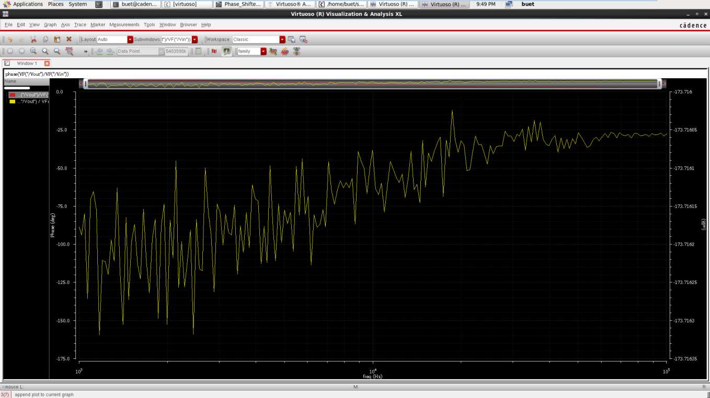
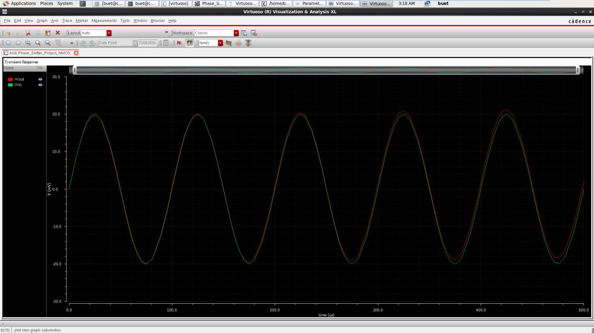
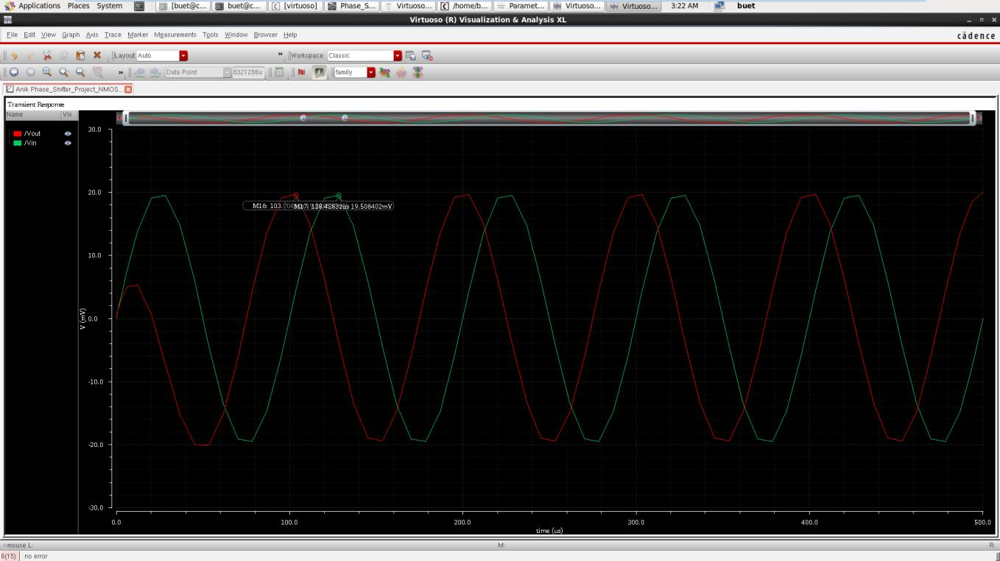
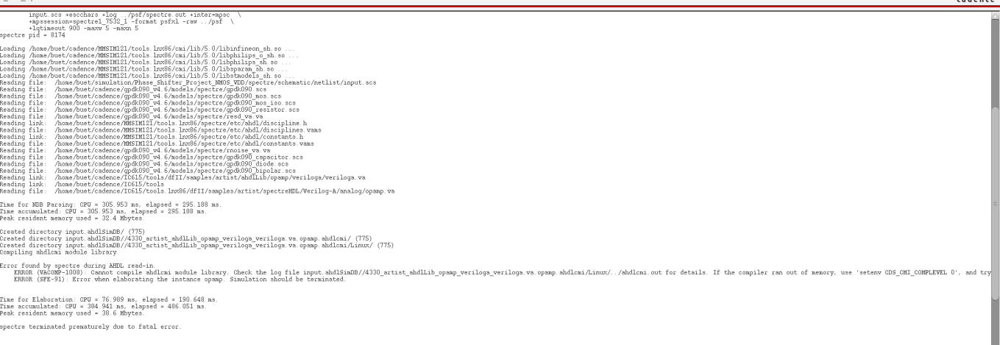

# Voltage-Controlled Positive Phase Shifter

A Cadence/Spectre simulation project implementing a **voltage-controlled positive phase shifter** using a **first-order active all-pass topology**, a **VCVS-based active stage**, and a **gpdk90 NMOS transistor as a voltage-controlled resistor**.

At the final 10 kHz design point, sweeping the control voltage from **0 V to 1 V** changes the simulated phase shift from approximately **1.18° to 90.66°**, while the gain remains close to **0 dB**.

> **Important limitation:** the final validated circuit uses an ideal VCVS, so the required **2 V to 5 V supply range was not fully verified**. A supply-powered `ahdlLib` op-amp was attempted, but Cadence/Spectre could not compile its AHDL/Verilog-A model in the available environment.

---

## Project Specifications

| Parameter | Required Value | Result in This Work |
|---|---:|---|
| Frequency range | 1-100 kHz | AC sweep performed from 1 kHz to 100 kHz |
| Phase-shift range | 0-90° | Approximately 1.18° to 90.66° at 10 kHz |
| Control voltage | 0-1 V | Swept from 0 V to 1 V |
| Supply voltage | 2-5 V | Not fully verified in the final VCVS implementation |

---

## Basic Idea

A phase shifter changes the phase position of a periodic signal without changing its frequency. For a sinusoidal input,

$$
V_{in}=A\sin(\omega t)
$$

and the shifted output is

$$
V_{out}=A\sin(\omega t+\phi)
$$

where $\phi$ is the phase shift.

At **10 kHz**,

$$
T=\frac{1}{f}=\frac{1}{10\text{ kHz}}=100\ \mu s
$$

so a **90°** phase shift corresponds to one quarter of a cycle:

$$
\Delta t=\frac{T}{4}=25\ \mu s
$$

---

## Why an All-Pass Filter?

A simple RC network can produce phase shift, but its magnitude also changes significantly with frequency. The all-pass topology was selected so that the circuit primarily changes phase while keeping the signal magnitude nearly constant.

For an ideal all-pass filter,

$$
|H(j\omega)|=1
$$

which corresponds to

$$
20\log_{10}|H(j\omega)|=0\text{ dB}
$$

The simulated gain variation was only in the milli-dB range, confirming nearly all-pass behavior.

---

## Theory

### 1. Negative-Phase All-Pass Version

The initial first-order circuit used the conventional lagging all-pass RC branch and produced a negative phase shift:

$$
H(s)=\frac{1-sRC}{1+sRC}
$$

$$
\phi=-2\tan^{-1}(\omega RC)
$$

This version was useful for debugging and understanding the NMOS resistance control, but the final target was a **positive phase shift**.

### 2. Positive-Phase All-Pass Version

To obtain a leading phase response, the capacitor was placed in series between `Vin` and `Vp`, while the controlled resistance path was connected from `Vp` to ground.

$$
H(s)=\frac{sRC-1}{sRC+1}
$$

$$
\phi=180^\circ-2\tan^{-1}(\omega RC)
$$

For a 90° shift,

$$
\omega RC=1
$$

therefore,

$$
R=\frac{1}{2\pi fC}
$$

Using

- $f=10\text{ kHz}$
- $C=100\text{ pF}$

results in

$$
R_{target}=\frac{1}{2\pi(10\text{ kHz})(100\text{ pF})}\approx159.15\text{ k}\Omega
$$

The final resistance path was therefore tuned to be close to **159.15 kΩ** at `Vctrl = 1 V`.

---

## NMOS as a Voltage-Controlled Resistor

A `gpdk90 nmos1v` device was used as the variable resistor. In the triode region, its approximate on-resistance is

$$
R_{on}\approx\frac{1}{\mu_n C_{ox}(W/L)(V_{GS}-V_{TH})}
$$

This relation gives the following qualitative behavior:

- Increasing `Vctrl` increases $V_{GS}$ and reduces the NMOS resistance.
- Increasing $W$ reduces resistance.
- Increasing $L$ increases resistance.
- The resistance is nonlinear with `Vctrl`, so the phase-vs-control characteristic is also nonlinear.

Because the real device behavior depends on the PDK model, the final transistor dimensions were obtained through simulation-based tuning rather than hand calculation alone.

---

## Fixed-Resistor Verification

Before introducing the NMOS, a fixed-resistor version was simulated to verify the all-pass structure.

| Component | Value | Purpose |
|---|---:|---|
| R1 | 100 kΩ | Input resistor at the inverting node |
| R2 | 100 kΩ | Feedback resistor; equal to R1 |
| Rvar | 159 kΩ | Approximately 90° phase shift at 10 kHz with 100 pF |
| C0 | 100 pF | Sets a practical resistance level at the 10 kHz design point |
| VCVS gain | 100k | High-gain active stage used as an idealized op-amp |

The simulation produced approximately **90°** phase shift near **10 kHz**, matching the theoretical calculation.



---

## Negative-Phase NMOS Version

After the fixed-resistor verification, `Rvar` was replaced by an NMOS. The first NMOS implementation used the lagging topology, so `Vout` lagged `Vin`.

The initial NMOS resistance was too small, producing only a small phase shift. The transistor dimensions were adjusted to increase resistance, using the fixed-resistor result of approximately **159 kΩ** as the target.

A tuned negative-phase version used approximately:

| Quantity | Value | Purpose |
|---|---:|---|
| NMOS | `gpdk90 nmos1v` | Voltage-controlled resistor |
| W | 3.5 µm | Final width used in the negative-phase tuning stage |
| L | 1 µm | Longer channel for higher resistive behavior |
| Rlim | 163 kΩ | Limited maximum resistance so the phase stayed near the desired range |
| C0 | 100 pF | Design capacitor |

This stage achieved approximately **-90° to 0°** and was used to understand the control behavior before changing to the final positive-phase topology.

---

## Final Positive-Phase Circuit

The key topology change was made in the `Vp` branch:

```text
Vin -> C0 -> Vp
Vp  -> Rseries -> NMOS -> GND
Vp  -> Rbias -> GND
```

`Rbias` is intentionally very large. It provides a DC path to ground so that `Vp` does not float when the NMOS is off, while having little effect on the AC response.

### Final Component Values

| Component / Parameter | Final Value | Reason |
|---|---:|---|
| R1 | 100 kΩ | Input resistor; equal to R2 for all-pass operation |
| R2 | 100 kΩ | Feedback resistor; equal to R1 for near-unity gain |
| C0 | 100 pF | Gives a 90° target resistance of about 159 kΩ at 10 kHz |
| Rseries | 153 kΩ | Combined with NMOS on-resistance to approach 159.15 kΩ |
| Rbias | 100 MΩ | Prevents `Vp` from floating while minimally loading the AC circuit |
| NMOS | `gpdk90 nmos1v` | Voltage-controlled resistor |
| NMOS W | 1.2 µm | Reduced leakage and improved the `Vctrl = 0 V` phase result |
| NMOS L | 1 µm | More resistor-like behavior and controlled $R_{on}$ |
| VCVS gain | 100k | High-gain active stage |
| Vctrl | 0-1 V | NMOS gate control voltage |



### Why `Rseries = 153 kΩ`?

At 10 kHz, the desired total branch resistance for approximately 90° phase shift is

$$
R_{total}\approx159.15\text{ k}\Omega
$$

with

$$
R_{total}\approx R_{series}+R_{on,NMOS}
$$

After transistor tuning with `W = 1.2 µm` and `L = 1 µm`, using `Rseries = 153 kΩ` produced approximately **90.66°** at `Vctrl = 1 V`.

### Why `Rbias = 100 MΩ`?

At `Vctrl = 0 V`, the NMOS is off and the capacitor blocks DC. Without a resistive path to ground, `Vp` can become a floating node and cause unstable or failed simulation. `Rbias = 100 MΩ` provides a DC path while negligibly loading the AC phase network.

---

## Cadence Implementation Procedure

1. Build the VCVS all-pass structure with `R1 = R2 = 100 kΩ`.
2. Verify the fixed-resistor version using `Rvar = 159 kΩ` and `C0 = 100 pF`.
3. Replace `Rvar` with a `gpdk90 nmos1v` NMOS and connect the gate to `Vctrl`.
4. Observe and tune the initial negative-phase response.
5. Change the `Vp` branch to the positive-phase topology:
   - `Vin -> C0 -> Vp`
   - `Vp -> Rseries -> NMOS -> GND`
6. Add `Rbias = 100 MΩ` from `Vp` to ground.
7. Run AC analysis from 1 kHz to 100 kHz.
8. Sweep `Vctrl` from 0 V to 1 V.
9. Plot gain to verify near-all-pass magnitude behavior.
10. Run transient simulations at `Vctrl = 0 V` and `Vctrl = 1 V`.

---

## Simulation Settings

| Simulation Item | Setting |
|---|---|
| AC frequency range | 1 kHz to 100 kHz |
| AC input | `V0`, AC magnitude = 1, DC = 0 |
| Control source | DC value = `vctrl` |
| Parametric sweep | `vctrl = 0 V` to `1 V` in `0.1 V` steps |
| Transient input | 10 kHz sine, 20 mV peak, 0 V DC |
| Transient stop time | 500 µs |
| Model library | `gpdk090.scs`, `NN` section |
| Phase expression | `phase(VF("/Vout") / VF("/Vin"))` |
| Gain expression | `dB20(VF("/Vout") / VF("/Vin"))` |

---

## Results

### Phase Control at 10 kHz

| Vctrl (V) | Phase Shift (°) |
|---:|---:|
| 0.0 | 1.18047 |
| 0.1 | 19.13928 |
| 0.2 | 68.0335 |
| 0.3 | 83.528 |
| 0.4 | 87.347 |
| 0.5 | 88.825 |
| 0.6 | 89.42781 |
| 0.7 | 89.50859 |
| 0.8 | 90.2587 |
| 0.9 | 90.372 |
| 1.0 | 90.657 |

The phase begins near **0°** at `Vctrl = 0 V` and reaches approximately **90°** at `Vctrl = 1 V`.



### Why the Phase Saturates Above About 0.5 V

The response is not linear with control voltage. Above approximately **0.5 V**, the NMOS is strongly on and its resistance becomes small compared with `Rseries`.

$$
R_{total}\approx R_{series}+R_{NMOS}
$$

Once $R_{NMOS}$ becomes small, additional increases in `Vctrl` produce little change in total resistance, so the phase remains close to 90°.

### Gain Result

The gain remains very close to **0 dB**, with only milli-dB variation, showing that the circuit mainly changes phase while keeping amplitude almost constant.



### Transient Result at `Vctrl = 0 V`

The AC phase shift is approximately **1.18°**. At 10 kHz,

$$
\Delta t=\frac{1.18}{360}\times100\ \mu s\approx0.33\ \mu s
$$

Therefore, `Vin` and `Vout` almost overlap.



### Transient Result at `Vctrl = 1 V`

At approximately 90° phase shift,

$$
\Delta t=\frac{90}{360}\times100\ \mu s=25\ \mu s
$$

The transient waveform shows `Vout` leading `Vin` by approximately one quarter of a cycle.



The first output peak is smaller because of start-up transient behavior. The capacitor starts from its initial condition, so the first cycle has not yet reached steady state. Phase and amplitude should therefore be evaluated from later cycles.

---

## Supply-Voltage Requirement and Op-Amp Issue

The original specification included a **2 V to 5 V supply range**. A real active amplifier would therefore require supply pins such as `VDD` and `VSS`.

The final working implementation uses a VCVS, which is an ideal voltage-controlled voltage source and has no supply pins. To verify the supply requirement, an `ahdlLib` op-amp was attempted with:

- `Vp` connected to the non-inverting input
- `Vm` connected to the inverting input
- output connected to `Vout`
- positive and negative supplies connected to `VDD` and `VSS`
- `vref` connected to ground
- gain set to `100k`
- unity-gain frequency set to `100e6`

Cadence/Spectre could not compile the AHDL/Verilog-A model. The reported messages included:

```text
ERROR (VACOMP-1008): Cannot compile ahdlcmi module library.
ERROR (SFE-91): Error when elaborating the instance opamp.
```

The detailed log also indicated that `cdsPerl` could not execute correctly. Because of this environment issue, the supply-powered simulation could not be completed, and the validated design remained VCVS-based.



---

## Issues Faced and Resolutions

| Issue | What Happened | Resolution |
|---|---|---|
| Understanding `Vin`, `Vp`, `Vm` | Node roles were initially confusing | Defined `Vin` as source input, `Vp` as the non-inverting phase-network node, and `Vm` as the inverting feedback node |
| Accidental `Vp`/`Vm` short | The two nodes were connected in an early schematic | Separated the nodes; `Vm` was kept only for R1, R2, and the VCVS negative input |
| Transient simulation did not run | Cadence reported that the cell was modified since extraction | Used **Check and Save** before simulation |
| Wrong ADE design state | ADE attempted to simulate an old cell | Closed ADE and relaunched it from the correct schematic |
| Negative phase response | First topology produced a lagging response | Changed the RC branch to the positive-phase topology |
| `Vctrl` response saturation | Phase changed very little above about 0.5 V | Explained by strong NMOS turn-on and `Rseries` dominating the total resistance |
| Supply op-amp compile failure | `ahdlLib` op-amp failed with an AHDL compile error | Returned to the VCVS implementation and documented the limitation |

---

## Verification Against Requirements

| Requirement | Final Observation | Status |
|---|---|---|
| 1-100 kHz frequency range | AC sweep performed over the full range | Verified in simulation |
| 0-90° phase shift | Approximately 1.18° to 90.66° at 10 kHz | Satisfied |
| 0-1 V control voltage | `Vctrl` swept over the full range | Satisfied |
| 2-5 V supply voltage | Could not be verified because the supply-powered `ahdlLib` op-amp failed to compile | Not fully satisfied in the final simulation |

---

## Final Design Summary

| Parameter | Final Value |
|---|---|
| Circuit type | Positive first-order active all-pass phase shifter |
| Active element | VCVS, gain = 100k |
| NMOS model | `gpdk90 nmos1v` |
| NMOS W | 1.2 µm |
| NMOS L | 1 µm |
| R1 | 100 kΩ |
| R2 | 100 kΩ |
| C0 | 100 pF |
| Rseries | 153 kΩ |
| Rbias | 100 MΩ |
| Vctrl range | 0-1 V |
| Final phase range at 10 kHz | Approximately 1.18° to 90.66° |

---

## Conclusion

A voltage-controlled positive phase shifter was successfully designed and simulated using a first-order active all-pass structure. The final circuit uses a VCVS as the active amplifier and a `gpdk90 nmos1v` transistor as the voltage-controlled resistor.

At **10 kHz**, sweeping `Vctrl` from **0 V to 1 V** changes the phase from approximately **1.18° to 90.66°**. The simulated gain stays very close to **0 dB**, and transient analysis confirms that the output is nearly in phase with the input at minimum control voltage and leads by approximately one quarter cycle at maximum control voltage.

The main unresolved limitation is verification of the **2 V to 5 V supply requirement**, because the available `ahdlLib` op-amp model could not be compiled in the Cadence environment.
