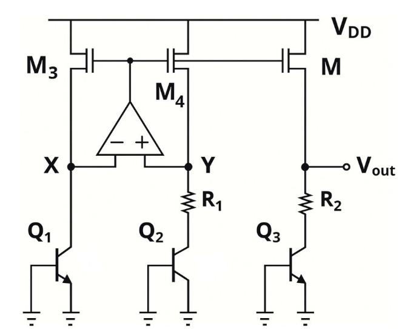
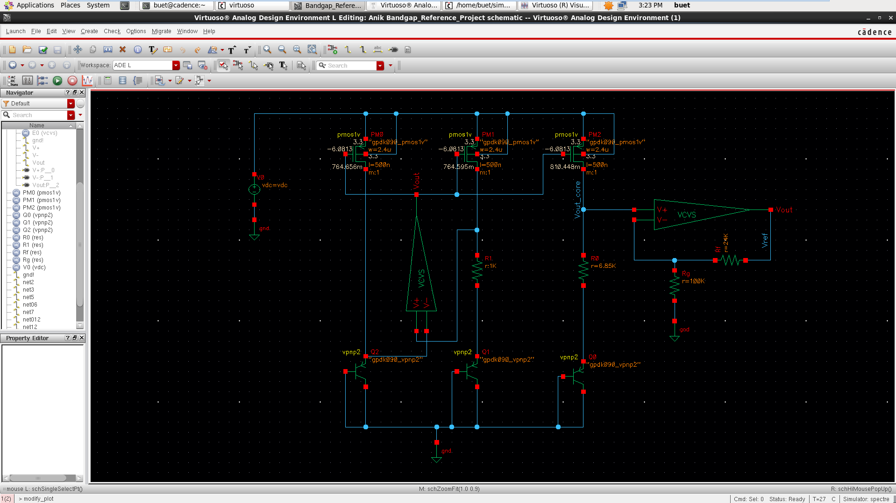
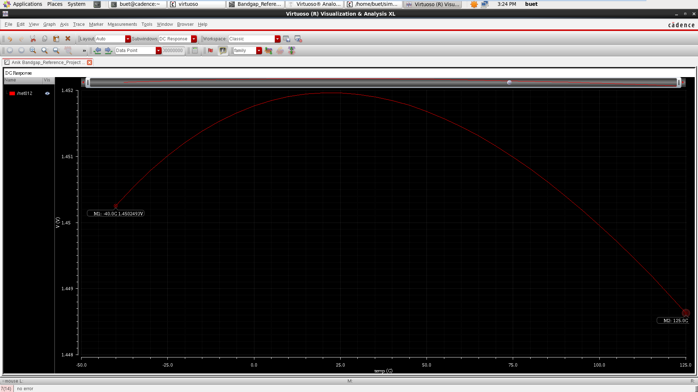

# Design and Simulation of a 1.45 V Bandgap Reference Circuit

> **Analog Integrated Electronics Course Project**

This project presents the design and simulation of a **bandgap reference (BGR) circuit** in **Cadence Virtuoso** using the **gpdk090** technology/PDK. The design target was a reference voltage between **1.4 V and 1.5 V** with a temperature coefficient between **10 ppm/°C and 17 ppm/°C** over the temperature range **-40°C to 125°C**.

The final design produces approximately **1.45 V** and achieves an estimated temperature coefficient of approximately **14.2 ppm/°C**.

## Project Information

| Item | Information |
|---|---|
| Student | Ahmed Lutfe Inam |
| Course | Analog Integrated Electronics |
| Software | Cadence Virtuoso |
| Technology / PDK | gpdk090 |
| Target VREF | 1.4 V to 1.5 V |
| Target temperature coefficient | 10 ppm/°C to 17 ppm/°C |
| Temperature range | -40°C to 125°C |
| Final VREF range | ~1.4486 V to ~1.4520 V |
| Final temperature coefficient | ~14.2 ppm/°C |

## Table of Contents

- [Project Objective and Specifications](#project-objective-and-specifications)
- [Bandgap Reference Theory](#bandgap-reference-theory)
- [Baseline Circuit](#baseline-circuit)
- [Circuit Operation](#circuit-operation)
- [Theoretical Calculations](#theoretical-calculations)
- [Final Component Values](#final-component-values)
- [Cadence Implementation](#cadence-implementation)
- [Simulation Setup](#simulation-setup)
- [Simulation Results](#simulation-results)
- [Temperature Coefficient Calculation](#temperature-coefficient-calculation)
- [Discussion](#discussion)
- [Final Design Summary](#final-design-summary)
- [Conclusion](#conclusion)

---

## Project Objective and Specifications

The objective of this project is to design a bandgap reference voltage circuit that generates an approximately constant DC voltage as temperature changes.

| Parameter | Required Value | Unit |
|---|---:|---|
| Reference voltage, VREF | 1.4 to 1.5 | V |
| Temperature range | -40 to 125 | °C |
| Temperature coefficient | 10 to 17 | ppm/°C |

The baseline concept and equations were taken from the laboratory experiment **“Design and Characterization of a Bandgap Reference Voltage Circuit.”** The baseline circuit uses a PMOS current mirror, PNP bipolar transistors, resistors, and an ideal op-amp implemented with a voltage-controlled voltage source (VCVS).

## Baseline Circuit

<p align="center">
  
</p>

The baseline bandgap structure contains three PMOS branches, three PNP BJT branches, resistors `R1` and `R2`, and an ideal op-amp that forces the required node relationship for PTAT generation.

---

## Bandgap Reference Theory

A bandgap reference generates a stable DC voltage by combining two voltages with opposite temperature characteristics:

- **CTAT component:** decreases with temperature.
- **PTAT component:** increases with temperature.

When these two temperature dependencies are properly weighted, their slopes approximately cancel and the output voltage becomes nearly temperature independent.

### CTAT Voltage: VBE

The base-emitter voltage of a BJT, `VBE`, decreases as temperature increases. This is the **CTAT** component.

For a silicon BJT, the `VBE` temperature slope is typically around:

$$
-1\ \text{mV/°C to } -2\ \text{mV/°C}
$$

depending on current density and the process model.

### PTAT Voltage: ΔVBE

If two BJTs operate at different emitter areas or current densities, their base-emitter voltages differ. This difference is:

$$
\Delta V_{BE}=V_T\ln(n)
$$

where:

$$
V_T=\frac{kT}{q}
$$

At room temperature:

$$
V_T \approx 25.85\ \text{mV}
$$

For an effective BJT area ratio of `n = 10`:

$$
\Delta V_{BE}=25.85\ \text{mV}\times\ln(10)\approx59.5\ \text{mV}
$$

Unlike `VBE`, `ΔVBE` increases with temperature, so it forms the PTAT component.

### Main Reference-Voltage Equation

The core reference-voltage equation used in this project is:

$$
V_{REF}=|V_{BE3}|+\left(\frac{R_2}{R_1}\right)V_T\ln(n)
$$

The two terms have opposite temperature slopes:

- `|VBE3|` is the CTAT contribution.
- `(R2/R1) VT ln(n)` is the PTAT contribution.

By selecting the resistor ratio `R2/R1`, the negative temperature slope of `VBE` can be compensated by the positive PTAT slope.

| Symbol | Meaning in this project |
|---|---|
| `VREF` | Final reference voltage required by the project |
| `VBE3` | Base-emitter voltage of the output BJT branch |
| `R1` | Converts `ΔVBE` into PTAT current |
| `R2` | Multiplies the PTAT voltage contribution |
| `VT` | Thermal voltage, `kT/q` |
| `n` | Effective BJT area ratio between PTAT-generating transistors |

---

## Circuit Operation

The circuit can be divided into four functional sections.

### 1. PMOS Current Mirror

The three PMOS transistors at the top act as current sources and copy current from one branch to the others. For improved matching, all three PMOS transistors are kept equal in size.

### 2. BJT Branches and Multipliers

The circuit uses PNP BJTs from the gpdk090 bipolar model. The BJT multiplier represents the number of identical unit devices connected in parallel.

| BJT branch | Multiplier | Purpose |
|---|---:|---|
| Left / reference BJT | 1 | Reference current-density branch |
| Middle / PTAT BJT | 10 | Larger effective area creates the current-density difference required for `ΔVBE = VT ln(10)` |
| Right / output BJT | 1 | Provides a suitable `VBE` for the output branch |

The left and middle branches generate `ΔVBE`. This voltage appears across `R1`, creating a PTAT current. The PTAT current then flows through `R2` in the output branch and adds a PTAT voltage to the output BJT `VBE`.

### 3. Ideal Op-Amp Using VCVS

The ideal op-amp is implemented using a **VCVS** with a gain of:

$$
A=100000
$$

The high gain forces the two input nodes to become nearly equal, which is necessary for generating the required `ΔVBE` and PTAT current.

### 4. Output Scaling Stage

The optimized low-temperature-coefficient bandgap core naturally produced about **1.17 V**, which did not satisfy the required **1.4 V to 1.5 V** output range.

A non-inverting gain stage was therefore added using another ideal VCVS op-amp and two resistors:

$$
V_{REF\_FINAL}=V_{out}\left(1+\frac{R_f}{R_g}\right)
$$

This stage scales the low-TC core voltage to approximately **1.45 V**.

---

## Theoretical Calculations

### BJT Area Ratio

The middle BJT multiplier was selected as `10`, while the left BJT multiplier was `1`:

$$
n=10
$$

At room temperature:

$$
\Delta V_{BE}=V_T\ln(10)
$$

$$
\Delta V_{BE}=25.85\ \text{mV}\times2.3026\approx59.5\ \text{mV}
$$

### Choosing R1 and R2

`R1` controls the PTAT current. The selected value was:

$$
R_1=1\ \text{k}\Omega
$$

Therefore:

$$
I_{PTAT}\approx\frac{\Delta V_{BE}}{R_1}
$$

$$
I_{PTAT}\approx\frac{59.5\ \text{mV}}{1\ \text{k}\Omega}=59.5\ \mu\text{A}
$$

`R2` controls the magnitude of the PTAT voltage added to the output. The resistor ratio is used to balance the positive and negative temperature slopes:

$$
\frac{dV_{REF}}{dT}\approx\frac{dV_{BE}}{dT}+\left(\frac{R_2}{R_1}\right)\frac{k}{q}\ln(n)
$$

Simulation-based fine tuning in gpdk090 showed that:

$$
R_2=6.85\ \text{k}\Omega
$$

with `R1 = 1 kΩ` gave the best low-TC region.

Thus:

$$
\frac{R_2}{R_1}=6.85
$$

This produced a core output near **1.17 V** with only a few millivolts of variation over `-40°C` to `125°C`.

### Output Scaling Gain

The optimized core output was approximately:

$$
V_{out}\approx1.17\ \text{V}
$$

The target final output was chosen near the center of the required range:

$$
V_{REF\_FINAL}\approx1.45\ \text{V}
$$

Required gain:

$$
A=\frac{1.45}{1.17}\approx1.24
$$

For a non-inverting amplifier:

$$
A=1+\frac{R_f}{R_g}
$$

Using:

$$
R_g=100\ \text{k}\Omega,\qquad R_f=24\ \text{k}\Omega
$$

produces:

$$
A=1+\frac{24k}{100k}=1.24
$$

and therefore:

$$
V_{REF\_FINAL}=1.17\times1.24\approx1.45\ \text{V}
$$

---

## Final Component Values

| Component / Parameter | Chosen Value | Reason |
|---|---:|---|
| Supply `VDC` | 3.3 V | Provides headroom for the 1.45 V output, PMOS mirror, BJTs, and op-amp; also used in the baseline lab setup |
| `R1` | 1 kΩ | Sets the PTAT current to about 59.5 µA for `n = 10` |
| `R2` | 6.85 kΩ | Best low-TC region after theoretical estimation and simulation tuning |
| BJT multipliers | 1 : 10 : 1 | Creates the required `ΔVBE` while maintaining a suitable output `VBE` |
| PMOS `W` | 2.4 µm | Maintains the baseline `W/L = 4.8` ratio with `L = 500 nm` |
| PMOS `L` | 500 nm | Longer than minimum length to improve analog current-mirror behavior and reduce channel-length modulation effects |
| PMOS multiplier | 1 | All PMOS devices kept equal for straightforward matching |
| VCVS gain | 100000 | Implements the ideal high-gain op-amp |
| `Rg` | 100 kΩ | Does not heavily load the bandgap core |
| `Rf` | 24 kΩ | With `Rg`, provides a gain of 1.24 |

### Why Simulation Tuning Was Needed

The theoretical equations provide the design direction, but the final Cadence result depends on the actual device models. The BJT `VBE` slope, resistor behavior, PMOS current-mirror accuracy, op-amp polarity, and operating point are not perfectly ideal.

For this reason, `R2` was tuned in simulation.

| Trial | Observed behavior | Decision |
|---|---|---|
| `R2 = 10.2 kΩ` | Output moved toward 1.4 V, but the temperature slope became too positive | Rejected for high TC |
| `R2 = 8.2 kΩ` | Temperature slope reduced, but TC was still too high | Rejected for high TC |
| `R2 = 6.85 kΩ` | Core output became nearly flat over temperature at about 1.17 V | Accepted as low-TC core |
| Gain stage = 1.24× | Scaled the low-TC core voltage to about 1.45 V | Accepted as final output solution |

---

## Cadence Implementation

### Bandgap Core Setup

1. Create or copy the baseline bandgap reference schematic from the laboratory experiment.
2. Use PMOS transistors from `gpdk090` and PNP BJTs from the gpdk090 bipolar model.
3. Set all three PMOS devices to:
   - `W = 2.4 µm`
   - `L = 500 nm`
   - `m = 1`
4. Set the BJT multipliers to:
   - Left = `1`
   - Middle = `10`
   - Right = `1`
5. Set `R1 = 1 kΩ`.
6. Set `R2 = 6.85 kΩ`.
7. Use a VCVS as the ideal op-amp with gain `100000`.
8. Name the bandgap core output node `Vout`.

### Output Scaling Stage

1. Add another ideal VCVS op-amp.
2. Connect `Vout` to its positive input.
3. Connect `Rg = 100 kΩ` from the negative input to ground.
4. Connect `Rf = 24 kΩ` from the final output back to the negative input.
5. Name the final output node `VREF_FINAL`.
6. Plot both `Vout` and `VREF_FINAL` during simulation.

### Final Cadence Schematic

<p align="center">
  
</p>

---

## Simulation Setup

| Simulation Item | Value Used |
|---|---:|
| Supply voltage, `VDC` | 3.3 V |
| Nominal temperature | 27°C |
| Temperature sweep | -40°C to 125°C |
| Temperature step | 5°C or suitable step |
| Output plotted | `VREF_FINAL` |

---

## Simulation Results

The final plotted output was `VREF_FINAL`. The temperature response has a slightly curved or parabolic shape. This is expected for a first-order bandgap reference because `VBE` is not perfectly linear with temperature.

The important quantities are the total output-voltage variation and the resulting temperature coefficient.

### VREF vs. Temperature

<p align="center">
  
</p>

### Voltage Range Check

From the final graph:

| Quantity | Approximate Value |
|---|---:|
| Minimum `VREF_FINAL` | 1.4486 V |
| Maximum `VREF_FINAL` | 1.4520 V |
| Required range | 1.4 V to 1.5 V |

The final output therefore satisfies the required reference-voltage range.

---

## Temperature Coefficient Calculation

The temperature coefficient was calculated using the max-min method:

$$
TC=\frac{V_{max}-V_{min}}{V_{nom}\Delta T}\times10^6
$$

Using the final simulation graph:

$$
V_{max}\approx1.4520\ \text{V}
$$

$$
V_{min}\approx1.4486\ \text{V}
$$

$$
V_{nom}\approx1.45\ \text{V}
$$

$$
\Delta T=125-(-40)=165^\circ\text{C}
$$

Therefore:

$$
TC=\frac{1.4520-1.4486}{1.45\times165}\times10^6
$$

$$
\boxed{TC\approx14.2\ \text{ppm/°C}}
$$

The required temperature coefficient is **10 ppm/°C to 17 ppm/°C**, so the design satisfies the project TC specification.

### Why the Temperature Curve Has a Peak

The final curve first increases slightly and then decreases slightly. This means:

- the slope is positive at lower temperature,
- close to zero near the peak,
- and negative at higher temperature.

This indicates that the positive PTAT slope and negative CTAT slope cancel near the middle of the temperature range. Since the total voltage variation is only a few millivolts, the design meets the intended specification.

---

## Discussion

The original laboratory circuit provided the essential bandgap reference structure, but it did not directly satisfy the project requirements for output voltage and temperature range.

Initial attempts were made to raise the core output directly into the `1.4 V to 1.5 V` range by increasing `R2`. Although this increased the output voltage, it also increased the positive temperature slope and produced an excessively high temperature coefficient.

`R2` was therefore reduced until the low-TC point was found. With:

$$
R_2=6.85\ \text{k}\Omega
$$

the bandgap core became nearly temperature independent, but its output was approximately `1.17 V`.

The final design strategy was therefore:

1. **Optimize the bandgap core for minimum temperature variation first.**
2. **Adjust the voltage level separately using a non-inverting gain stage.**

In the ideal simulation, the scaling stage changes the reference-voltage level without significantly changing the ppm/°C value, provided the gain itself is temperature independent.

---

## Final Design Summary

| Block | Final Value |
|---|---|
| Bandgap core supply | `VDC = 3.3 V` |
| Bandgap core resistors | `R1 = 1 kΩ`, `R2 = 6.85 kΩ` |
| BJT multipliers | Left = 1, Middle = 10, Right = 1 |
| PMOS devices | `W = 2.4 µm`, `L = 500 nm`, `m = 1` |
| Ideal op-amp gain | `100000` |
| Gain-stage resistors | `Rg = 100 kΩ`, `Rf = 24 kΩ` |
| Final VREF range | ~1.4486 V to ~1.4520 V |
| Final TC | ~14.2 ppm/°C |

### Requirement Check

| Requirement | Target | Achieved |
|---|---:|---:|
| Reference voltage | 1.4 V to 1.5 V | ~1.4486 V to ~1.4520 V |
| Temperature range | -40°C to 125°C | -40°C to 125°C |
| Temperature coefficient | 10 to 17 ppm/°C | ~14.2 ppm/°C |

---

## Conclusion

A bandgap reference circuit was designed and simulated in Cadence Virtuoso using gpdk090. The core circuit was first optimized for a low temperature coefficient using:

- `R1 = 1 kΩ`
- `R2 = 6.85 kΩ`
- BJT multipliers = `1 : 10 : 1`

The optimized core produced a stable output of approximately **1.17 V**. Because the required output range was **1.4 V to 1.5 V**, a non-inverting gain stage with a gain of approximately **1.24** was added.

The final output remained approximately **1.45 V** from **-40°C to 125°C**, with an estimated temperature coefficient of approximately **14.2 ppm/°C**. The final simulated design therefore satisfies both the reference-voltage and temperature-coefficient specifications stated for the project.

---

## Repository Structure

```text
.
├── README.md
└── assets/
    ├── baseline_bandgap_circuit.jpeg
    ├── final_cadence_schematic.png
    └── vref_temperature_plot.png
```

