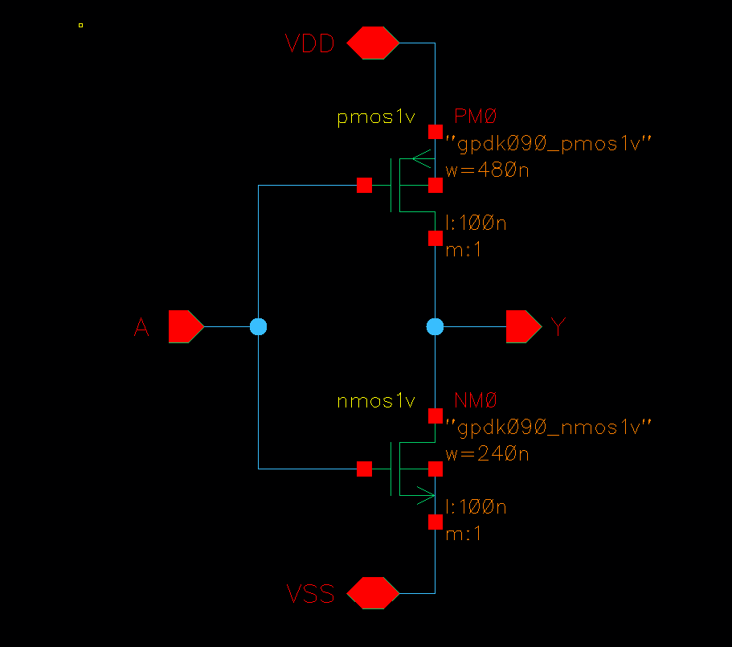
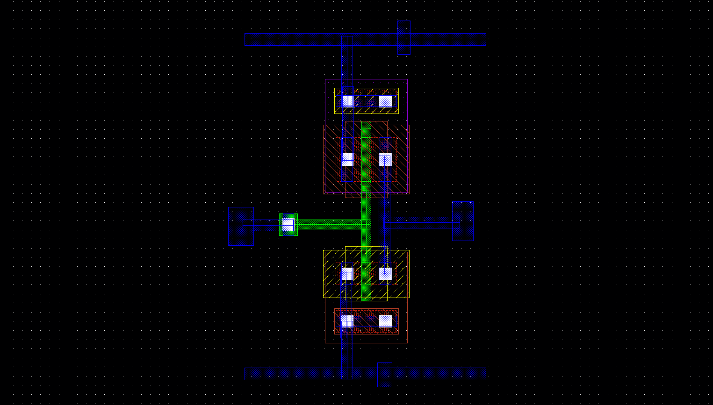

# CMOS Inverter Layout using Cadence Virtuoso

## Project Summary

This project contains the full-custom layout design of a CMOS inverter using Cadence Virtuoso.  
The inverter was designed using one PMOS and one NMOS transistor from the GPDK 90 nm 1 V device library.

The project includes schematic design, custom layout, body contacts, layout pins, DRC verification, LVS verification, and documentation.

## Verification Summary

| Check | Result |
|---|---|
| Schematic | Completed |
| Layout | Completed |
| DRC | Passed with zero errors |
| LVS | Schematic and layout matched |
| Simulation | CMOS inverter behavior verified |

## Tools and Technology

| Item | Used |
|---|---|
| EDA Tool | Cadence Virtuoso |
| PDK | GPDK 90 nm |
| Devices | `nmos1v`, `pmos1v` |
| DRC Tool | Assura DRC |
| LVS Tool | Assura LVS |
| Waveform Viewer | ViVA |
| Environment | VMware Linux |

## Device Sizing

| Device | Width | Length | Purpose |
|---|---:|---:|---|
| NMOS | 240 nm | 100 nm | Pull-down device |
| PMOS | 480 nm | 100 nm | Pull-up device |

The PMOS width was chosen larger than the NMOS width to help balance the pull-up and pull-down strength of the inverter.

## Repository Structure

| Folder / File | Description |
|---|---|
| `README.md` | Main GitHub documentation file |
| `report/` | Contains the editable project report |
| `images/` | Contains schematic, layout, DRC, and LVS screenshots |
| `cadence_files/` | Contains compressed Cadence design files |

## Included Files

| Location | File | Description |
|---|---|---|
| `report/` | `CMOS_Inverter_Layout_Project_Report.docx` | Editable project report |
| `images/` | `schematic.png` | CMOS inverter schematic screenshot |
| `images/` | `layout.png` | Final CMOS inverter layout screenshot |
| `images/` | `no drc.png` | DRC result showing zero errors |
| `images/` | `LVS Summary.png` | LVS result showing schematic-layout match |
| `cadence_files/` | `CMOS_inverter_cadence_files.tar.gz` | Compressed Cadence project files |

## Project Images

| Schematic | Layout |
|---|---|
|  |  |

| DRC Result | LVS Result |
|---|---|
|  |  |

## CMOS Inverter Operation

A CMOS inverter produces the opposite logic value of the input.

| Input A | Output Y |
|---|---|
| 0 | 1 |
| 1 | 0 |

When the input is low, the PMOS turns ON and pulls the output up to VDD.  
When the input is high, the NMOS turns ON and pulls the output down to VSS.

## Layout Work Completed

| Step | Description |
|---|---|
| 1 | Created schematic using one PMOS and one NMOS |
| 2 | Created layout view in Cadence Virtuoso |
| 3 | Placed PMOS at the top and NMOS at the bottom |
| 4 | Added VDD and VSS Metal1 rails |
| 5 | Connected PMOS source to VDD |
| 6 | Connected NMOS source to VSS |
| 7 | Connected PMOS and NMOS drains together as output `Y` |
| 8 | Connected PMOS and NMOS gates together as input `A` |
| 9 | Added poly-to-Metal1 contact for input routing |
| 10 | Added PMOS body contact and connected it to VDD |
| 11 | Added NMOS body contact and connected it to VSS |
| 12 | Added layout pins: `A`, `Y`, `VDD`, and `VSS` |
| 13 | Ran DRC and achieved zero errors |
| 14 | Ran LVS and achieved schematic-layout match |

## How to Open the Cadence Files

The Cadence design is provided as a compressed archive:

| File | Location |
|---|---|
| `CMOS_inverter_cadence_files.tar.gz` | `cadence_files/` |

### Requirements

Another user needs the following setup to open and verify the design:

| Requirement | Purpose |
|---|---|
| Cadence Virtuoso | To open schematic and layout |
| GPDK 90 nm PDK | To load `nmos1v` and `pmos1v` devices |
| Assura DRC/LVS | To rerun physical verification |
| Linux environment | To run Cadence Virtuoso |

The GPDK 90 nm PDK is not included in this repository because PDK files may have licensing restrictions.

### Step-by-Step Opening Procedure

| Step | Action |
|---|---|
| 1 | Download `CMOS_inverter_cadence_files.tar.gz` from the `cadence_files/` folder |
| 2 | Copy the file to a Cadence working directory, for example `~/cadence` |
| 3 | Extract the archive using `tar -xzf CMOS_inverter_cadence_files.tar.gz` |
| 4 | If it extracts as `home/buet/CMOS_inverter`, move it using `mv home/buet/CMOS_inverter ./CMOS_inverter` |
| 5 | Open the `cds.lib` file in the Cadence working directory |
| 6 | Add this library definition: `DEFINE Anik /home/USERNAME/cadence/CMOS_inverter` |
| 7 | Replace `USERNAME` with the actual Linux username |
| 8 | Start Cadence using `virtuoso &` |
| 9 | Open Library Manager and select `Anik → CMOS_inverter` |
| 10 | Open either the `schematic` view or the `layout` view |

Example `cds.lib` line:

`DEFINE Anik /home/student/cadence/CMOS_inverter`

## Notes for Reuse

| Item | Note |
|---|---|
| Library name | The original Cadence library name is `Anik` |
| Cell name | The main cell name is `CMOS_inverter` |
| PDK dependency | The project depends on GPDK 90 nm |
| PDK files | Not included due to licensing restrictions |
| If PDK is missing | The project may not open correctly in Cadence |

## Final Result

| Verification | Status |
|---|---|
| DRC | Passed with zero errors |
| LVS | Schematic and layout matched |
| Functionality | Inverter operation verified |

This project demonstrates the basic full-custom IC layout flow from schematic design to verified layout using Cadence Virtuoso.
