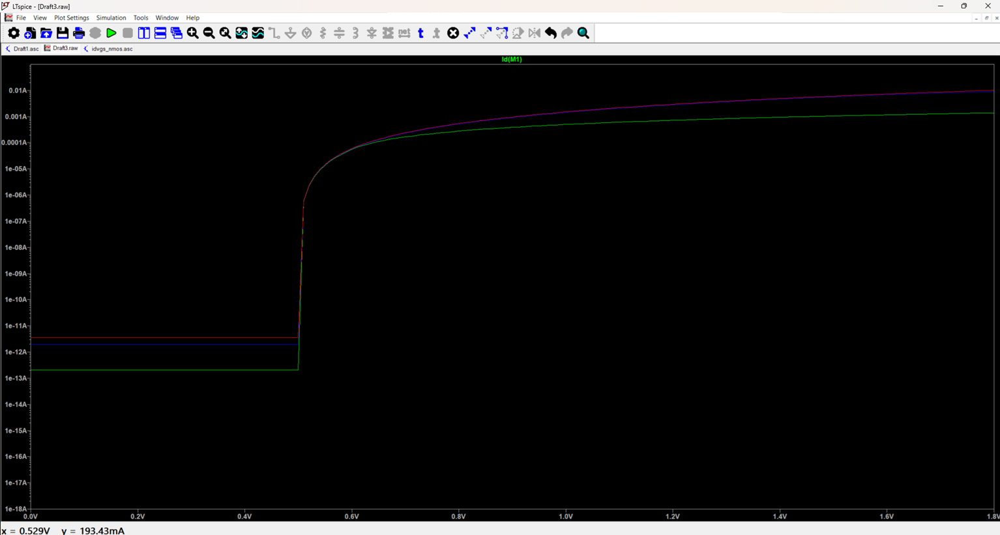
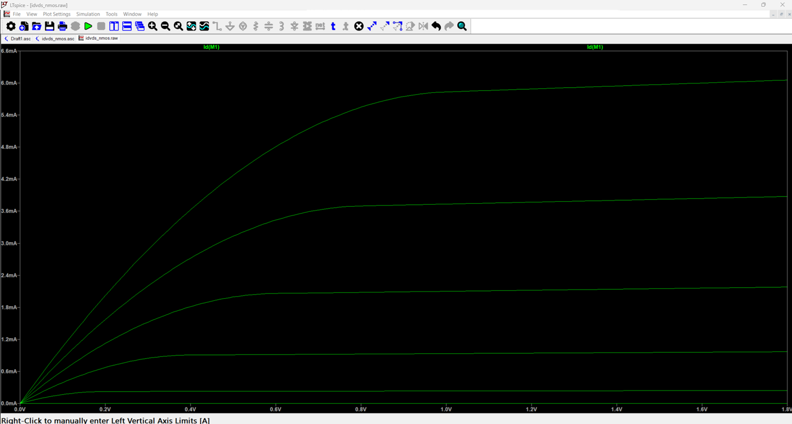
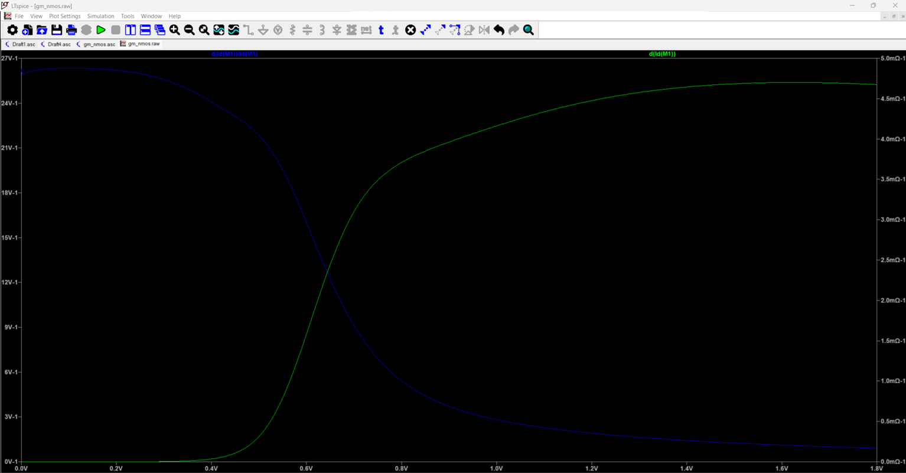
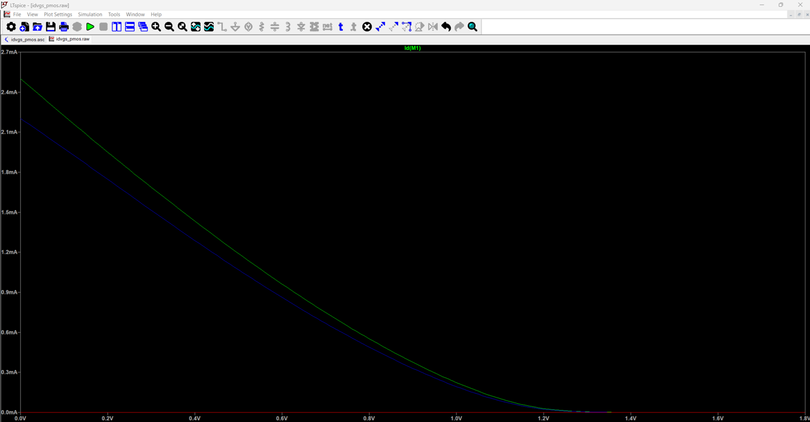
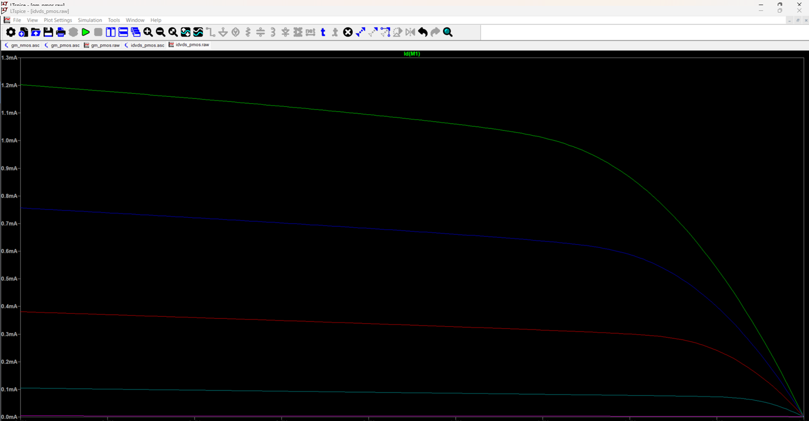
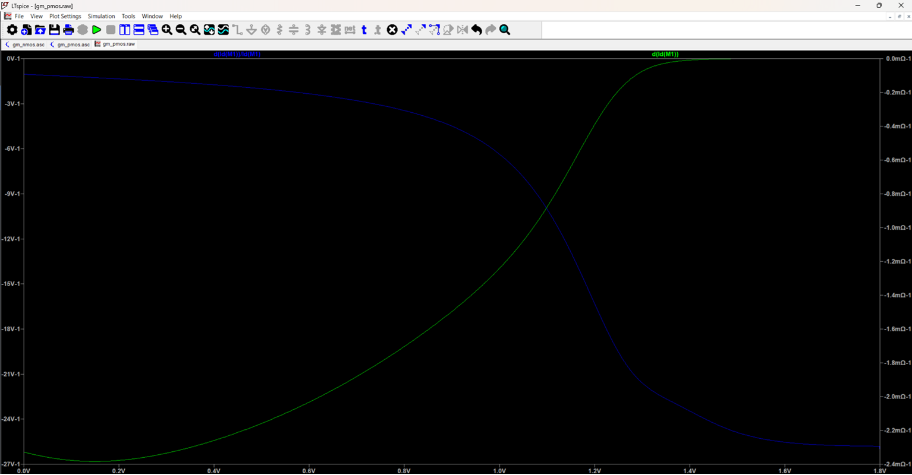

# MOSFET Characterization Suite

<p align="center">
  <b>NMOS and PMOS Characterization using TSMC 180nm BSIM3 Model in LTspice</b>
</p>

<p align="center">
  
  
  
  
</p>

---

## Overview

This repository contains a complete **MOSFET Characterization Suite** for both **NMOS** and **PMOS** devices using the **TSMC 180nm BSIM3 model** in **LTspice**.

The project focuses on practical MOSFET behavior for analog IC design. It includes DC sweep simulations, operating-point extraction, exported plots, and a short project report for reference.

The main simulations include:

- `Id vs Vgs` characterization
- `Id vs Vds` characterization
- `gm vs Vgs` analysis
- `gm/Id vs Vgs` analysis
- `.op` operating-point extraction

---

## Tools and Technology

| Category | Details |
|---|---|
| Simulator | LTspice 26 |
| Technology | TSMC 180nm |
| MOS Model | BSIM3v3 |
| Supply Voltage | 1.8 V |
| Device Width | 10 µm |
| Device Length | 0.18 µm |
| Devices | NMOS and PMOS |

---

## Repository Structure

The repository is organized into separate **NMOS**, **PMOS**, and **report** folders.

Inside both `NMOS/` and `PMOS/`, the files are separated into:

- `images/` — exported simulation plots
- `ltspice_files/` — LTspice schematic, raw, log, netlist, and model files

```text
MOSFET-Characterization-Suite/
│
├── NMOS/
│   ├── images/
│   │   ├── gmid_vs_vgs_nmos.png
│   │   ├── idvds_nmos.png
│   │   ├── idvgs_nmos_log.png
│   │   └── idvgs_nmos_linear.jpg
│   │
│   └── ltspice_files/
│       ├── gm_nmos.asc
│       ├── gm_nmos.log
│       ├── gm_nmos.raw
│       ├── idvds_nmos.asc
│       ├── idvds_nmos.log
│       ├── idvds_nmos.raw
│       ├── idvgs_nmos.asc
│       ├── idvgs_nmos.log
│       ├── idvgs_nmos.raw
│       ├── op_nmos.asc
│       ├── op_nmos.log
│       ├── op_nmos.raw
│       └── tsmc_180nm.lib
│
├── PMOS/
│   ├── images/
│   │   ├── gm_pmos.png
│   │   ├── idvds_pmos.png
│   │   └── idvgs_pmos.png
│   │
│   └── ltspice_files/
│       ├── gm_pmos.asc
│       ├── gm_pmos.log
│       ├── gm_pmos.raw
│       ├── idvds_pmos.asc
│       ├── idvds_pmos.log
│       ├── idvds_pmos.raw
│       ├── idvgs_pmos.asc
│       ├── idvgs_pmos.log
│       ├── idvgs_pmos.net
│       ├── idvgs_pmos.raw
│       └── tsmc_180nm.lib
│
├── report/
│   └── Project Summary Report.pdf
│
└── README.md
```

---

## Project Report

The complete project summary report is available in the `report/` folder.

📄 **Report:** [Project Summary Report](report/Project%20Summary%20Report.pdf)

The report contains the project purpose, simulation setup, result plots, extracted parameters, and key design insights.

---

## Simulation Summary

| Simulation | Device | Purpose |
|---|---|---|
| `idvgs_nmos.asc` | NMOS | Drain current vs gate-source voltage |
| `idvds_nmos.asc` | NMOS | Drain current vs drain-source voltage |
| `gm_nmos.asc` | NMOS | Transconductance and gm/Id analysis |
| `op_nmos.asc` | NMOS | Operating-point and small-signal parameter extraction |
| `idvgs_pmos.asc` | PMOS | Drain current vs gate-source voltage |
| `idvds_pmos.asc` | PMOS | Drain current vs drain-source voltage |
| `gm_pmos.asc` | PMOS | Transconductance and gm/Id analysis |

---

## Key Results

| Parameter | NMOS | PMOS |
|---|---:|---:|
| Threshold Voltage | ~0.35 V | ~-0.42 V |
| Reference Bias | Vgs = 0.9 V, Vds = 0.9 V | Vgs = 0.9 V, Vds = 0.9 V |
| Overdrive Voltage | ~0.55 V | ~0.48 V |
| Drain Current | ~1.07 mA | - |
| Transconductance | ~4.0 mA/V | ~2.2 mA/V |
| gm/Id | ~3.79 V⁻¹ | ~4.5 V⁻¹ |
| Output Resistance | ~2.86 kΩ | - |
| Intrinsic Gain | ~11.4 V/V | - |

---

## NMOS Simulation Plots

### NMOS Id vs Vgs

The NMOS `Id vs Vgs` plot shows the turn-on behavior of the transistor.  
The threshold voltage is approximately **0.35 V**.

<p align="center">
  
</p>

<p align="center">
  
</p>

### NMOS Id vs Vds

The NMOS `Id vs Vds` sweep shows the triode and saturation regions.  
The saturation knee shifts to the right as `Vgs` increases.

<p align="center">
  
</p>

### NMOS gm and gm/Id vs Vgs

The `gm/Id` plot is useful for analog bias selection.  
High `gm/Id` indicates low-power operation, while lower `gm/Id` corresponds to stronger inversion and higher-speed operation.

<p align="center">
  
</p>

---

## PMOS Simulation Plots

### PMOS Id vs Vgs

The PMOS `Id vs Vgs` curve behaves as a mirror counterpart of NMOS.  
The device is strongly ON near `Vgs = 0 V` and turns OFF as `Vgs` approaches the supply voltage.

<p align="center">
  
</p>

### PMOS Id vs Vds

The PMOS `Id vs Vds` sweep shows the PMOS output characteristics across different bias conditions.

<p align="center">
  
</p>

### PMOS gm and gm/Id vs Vgs

The PMOS transconductance magnitude is lower than the NMOS transconductance due to lower hole mobility.  
In this setup, PMOS peak gm is approximately **55% of NMOS gm**.

<p align="center">
  
</p>

---

## How to Run the LTspice Files

### 1. Download or Clone the Repository

```bash
git clone https://github.com/your-username/your-repository-name.git
```

### 2. Open the LTspice File Folder

For NMOS simulations:

```text
NMOS/ltspice_files/
```

For PMOS simulations:

```text
PMOS/ltspice_files/
```

### 3. Open a Schematic File

Open any `.asc` file in LTspice. For example:

```text
idvgs_nmos.asc
idvds_nmos.asc
gm_nmos.asc
op_nmos.asc
idvgs_pmos.asc
idvds_pmos.asc
gm_pmos.asc
```

### 4. Check the Model Library

Make sure `tsmc_180nm.lib` is present inside the same `ltspice_files/` folder as the schematic.

The schematic should include the model file using:

```spice
.include tsmc_180nm.lib
```

If LTspice shows a missing library error, update the `.include` path according to the location of `tsmc_180nm.lib`.

### 5. Run the Simulation

Click the **Run** button in LTspice.  
The simulation will generate or update the `.raw` and `.log` files.

---

## File Type Guide

| File Type | Description |
|---|---|
| `.asc` | LTspice schematic file |
| `.raw` | LTspice waveform/simulation data |
| `.log` | LTspice simulation log |
| `.net` | Generated LTspice netlist |
| `.lib` | TSMC 180nm model library |
| `.png`, `.jpg` | Exported simulation plots |
| `.pdf` | Project summary report |

---

## Design Insights

- NMOS threshold voltage is approximately **0.35 V**.
- PMOS threshold voltage magnitude is approximately **0.42 V**.
- `gm/Id` is a key parameter for selecting bias points in analog design.
- High `gm/Id` is useful for low-power and low-noise operation.
- Lower `gm/Id` is used for stronger inversion and higher-speed operation.
- PMOS has lower gm than NMOS due to lower hole mobility.
- PMOS often needs to be wider than NMOS to achieve similar transconductance.
- Minimum channel length is useful for speed, but longer channel length is preferred for analog gain because it improves output resistance.

---

## Project Status

| Item | Status |
|---|---|
| NMOS Id vs Vgs | Completed |
| NMOS Id vs Vds | Completed |
| NMOS gm and gm/Id | Completed |
| NMOS operating-point extraction | Completed |
| PMOS Id vs Vgs | Completed |
| PMOS Id vs Vds | Completed |
| PMOS gm and gm/Id | Completed |
| Project summary report | Completed |

---

## Notes

This project is intended for learning and reference purposes.  
The results depend on the included TSMC 180nm BSIM3 model, transistor dimensions, bias conditions, and LTspice simulation setup.
